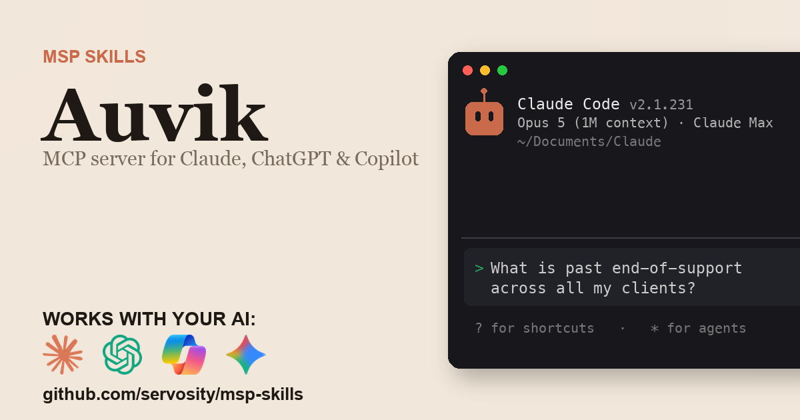

# Auvik + AI - for ChatGPT, Claude, GitHub Copilot, Microsoft 365 Copilot, Gemini, and any agent that speaks MCP

> Unofficial. Community-built Claude Code Skill and MCP server for the Auvik
> API. Not affiliated with, endorsed by, or sponsored by Auvik Networks Inc..

<!-- media:start -->
<p align="center">
  <a href="https://msp-skills.compoundingteams.com/skills/auvik/">
    
  </a>
</p>
<p align="center"><sub><a href="https://msp-skills.compoundingteams.com/skills/auvik/">Full skill page</a> - install, outcomes, safety model.</sub></p>
<!-- media:end -->

Every Auvik endpoint as a command, plus the cross-client answers the Auvik UI and API cannot give you. Works with the AI you already use - **ChatGPT** (Plus/Pro+), **Claude Desktop**, **Codex**, **Claude Code**, **Claude Cowork**, and **GitHub Copilot** - plus **Microsoft 365 Copilot / Copilot Studio** and **Google Gemini** via the remote path. Free, open source, runs on your laptop. Built for MSP owners. No code required.

## Works with your agent

The six agents MSP owners actually use (self-serve, works today):

| Your AI agent | How to install the Auvik skill |
| --- | --- |
| **Claude Desktop** | Run installer, then **Settings > Extensions** to register `auvik-mcp` (no JSON editing). |
| **ChatGPT** (paid plans) | Run installer, expose `auvik-mcp` over HTTPS, register as a Developer Mode connector. |
| **Codex CLI** | Paste the install prompt below. |
| **Claude Code** | Paste the install prompt below. |
| **Claude Cowork** | Paste the install prompt below. |
| **GitHub Copilot** (VS Code) | Run installer, add `auvik-mcp` to `mcp.json` under the `servers` key, then pick **Agent** mode. |

For ChatGPT, run `auvik-mcp --transport http` and expose that behind HTTPS - no bridge package is needed. See [mcp-install.md](./mcp-install.md).

### Also for the Microsoft and Google stacks

Big install base, but an honest heads-up: these are the **remote / enterprise** path, not the local binary you just installed.

| Agent | What it takes |
| --- | --- |
| **Microsoft 365 Copilot / Copilot Studio** | **Not self-serve.** Host `auvik-mcp` over HTTPS, then wire it into Copilot Studio (**Tools > Add a tool > Model Context Protocol > Server URL**) or a declarative agent. Needs a Copilot Studio license + tenant admin. See [mcp-install.md](./mcp-install.md). |
| **Google Gemini** | **Gemini CLI** is local - same as Claude Code. The **Gemini app** is remote - same HTTPS path as ChatGPT. See [mcp-install.md](./mcp-install.md). |

> **Skill-native agents (also covered):** [Hermes](https://hermes-agent.nousresearch.com) and [OpenClaw](#install-for-openclaw) read this skill's `SKILL.md` directly *and* speak MCP - see their install sections below. Also works with Cursor, Windsurf, Cline, Continue.dev, and Zed via MCP. Full per-tool wire-up: **[docs/which-agent.md](../../docs/which-agent.md)**.

> **Run more than one agent?** Install across all 51+ supported agents in one command: `npx skills add Servosity/msp-skills@latest` (requires Node.js, then run the per-skill installer for the CLI/MCP binaries). See [docs/which-agent.md](../../docs/which-agent.md#install-across-all-your-agents-at-once).

## Install in 60 seconds

### Fastest for Claude Desktop - one-click `.mcpb`

[**Download Auvik MCP (.mcpb)**](https://github.com/servosity/msp-skills/releases/download/auvik-v0.1.0/auvik-mcp.mcpb) - then open **Claude Desktop > Settings > Extensions** and select the file. One click, no JSON, no shell. (Browse every Auvik release on the [releases page](https://github.com/servosity/msp-skills/releases?q=auvik).)

Prefer the Claude Code plugin? Add the marketplace once, then install - works immediately, no directory listing required:

```
/plugin marketplace add Servosity/msp-skills
/plugin install auvik@msp-skills
```

### Path A - paste one prompt into your AI agent (recommended)

Copy this into **Claude Code**, **Codex CLI**, or **Claude Cowork**:

> Install the Auvik Skill and MCP server from Servosity/msp-skills in this agent workspace. If this workspace uses a POSIX shell (macOS, Linux, WSL, or Bash), run `bash <(curl -fsSL https://raw.githubusercontent.com/Servosity/msp-skills/main/skills/auvik/install.sh)`. If it uses Windows PowerShell, run `iwr -useb https://raw.githubusercontent.com/Servosity/msp-skills/main/skills/auvik/install.ps1 | iex`. Then authenticate per the README and run `auvik-cli --help` to explore.

The same prompt works in any agent that can run shell.

### Path B - run the installer yourself

**Windows (PowerShell):**

```powershell
iwr -useb https://raw.githubusercontent.com/Servosity/msp-skills/main/skills/auvik/install.ps1 | iex
```

**macOS / Linux:**

```bash
bash <(curl -fsSL https://raw.githubusercontent.com/Servosity/msp-skills/main/skills/auvik/install.sh)
```

The installer drops both `auvik-cli` (the CLI) and `auvik-mcp` (the MCP server) into your user bin path. Claude Code, Codex, and Cowork discover the Skill via `SKILL.md` in this directory.

Verify:

```bash
auvik-cli --version
```

### Upgrade to the latest version

The installer always fetches the current release - re-run it to upgrade:

**macOS / Linux:**

```bash
bash <(curl -fsSL https://raw.githubusercontent.com/Servosity/msp-skills/main/skills/auvik/install.sh)
```

**Windows (PowerShell):**

```powershell
iwr -useb https://raw.githubusercontent.com/Servosity/msp-skills/main/skills/auvik/install.ps1 | iex
```

Claude Desktop `.mcpb` users: download the latest `.mcpb` (top of this section) and re-select it in **Settings > Extensions**. Claude Code plugin users: `/plugin update auvik@msp-skills`.

### Add to Claude Desktop, GitHub Copilot, Gemini CLI, Microsoft 365 Copilot, or another MCP client

After the installer runs, see **[mcp-install.md](./mcp-install.md)** and **[docs/which-agent.md](../../docs/which-agent.md)** for the per-agent wire-up - one section per agent, including the GitHub Copilot `servers` key and the remote Microsoft 365 Copilot / Copilot Studio path. Claude Desktop's Settings > Extensions panel is the simplest path; the MCP config block (for users who prefer editing JSON) is documented in mcp-install.md.

<!-- pp-hermes-install-anchor -->
### Install for Hermes

From the Hermes CLI:

```bash
hermes skills install servosity/msp-skills/skills/auvik --force
```

Inside a Hermes chat session:

```
/skills install servosity/msp-skills/skills/auvik --force
```

Hermes [speaks MCP natively](https://hermes-agent.nousresearch.com), so it can also use the `auvik-mcp` server directly - same install path, same env vars.

### Install for OpenClaw

Tell your OpenClaw agent (copy this):

> Install the auvik skill from https://github.com/servosity/msp-skills/tree/main/skills/auvik. The skill defines how its required CLI (`auvik-cli`) can be installed via the `openclaw:` frontmatter block.

OpenClaw isn't generally available yet; the frontmatter wiring is pre-shipped and will activate the moment OpenClaw launches.

### Authenticate

Set the credentials the CLI needs (from your Auvik portal):

```bash
AUVIK_USERNAME=<value> AUVIK_API_KEY=<value> auvik-cli doctor
```

`doctor` checks config, paths, and API reachability, and reports whether credentials are loaded - it does not validate them. Run a read command to confirm the credential actually works end-to-end.


## What this skill does

| Question your MSP keeps asking | Command |
| --- | --- |
| What hardware is past end-of-support across every client? | `auvik-cli eol --bucket expired` |
| What ages out in the next 90 days, for the QBR deck? | `auvik-cli eol --within 90` |
| Which devices have no configuration backup at all? | `auvik-cli configuration audit --finding no_backup` |
| What was added, changed, or removed fleet-wide since the last sync? | `auvik-cli inventory diff --since 7d` |
| Which clients' billed device counts disagree with their inventory? | `auvik-cli usage reconcile --mismatch-only` |
| Which devices can Auvik not fully poll, and which credential is failing? | `auvik-cli device discovery-gaps --method snmp` |
| Which devices and clients generate the most alert noise? | `auvik-cli alert noise --since 30d --group-by client` |
| Which SaaS licences is nobody using? | `auvik-cli asm shadow --finding unused_licenses` |

Full command reference: [guide.md](./guide.md). For the AI-agent operating contract (`--agent`, `--dry-run`, when to confirm before mutating), see [AGENTS.md](./AGENTS.md).

## What makes this different

Most Auvik integrations and MCP servers proxy each question into a live API call. That's fine for one record. It dies at scale, when you are asking "what is past end-of-support across all 40 clients, and which of it is still under warranty" the week before a QBR.

This skill syncs Auvik into a **local SQLite mirror** with full-text search. Aggregate questions become one local SQL join: instant, offline, and the AI sees the answer, not the raw data. Compound commands like `eol`, `usage reconcile`, and `changes` join across device inventory, lifecycle and warranty dates, billing usage records, config revisions, entity audit entries and alert history - work a stateless API wrapper cannot do.

One gap is structural rather than a matter of convenience: **Auvik's API emits no deletion event.** `filter[modifiedAfter]` surfaces additions and changes only, so a decommissioned device simply stops appearing in list responses. A removal is detectable only by keeping your own prior view of the fleet, which is exactly what `inventory diff --snapshot` records.

## The pain this closes

Auvik bills per billable device, and the count that drives the invoice is a number on a screen. When it moves, nothing shows you which devices moved it, and the practical answer ends where the tooling does: export it and count by hand. That is the shape of every question an owner actually asks of Auvik: the data is there, the aggregate is not.

- **The invoice argument.** `usage reconcile --mismatch-only` puts each client's billed count next to the synced inventory and names the device rows on both sides of the difference.
- **The refresh conversation.** `eol --within 90` buckets every device by the earliest of its end-of-support, end-of-life, end-of-sale, and warranty dates, across every client at once.
- **The silent decommission.** `inventory diff --since 7d` reports what left, which the Auvik API never tells you.
- **The unbacked-up switch.** `configuration audit --finding no_backup` finds devices with no stored config backup, a stale one, or none flagged running.
- **The box nobody can see.** `device discovery-gaps` joins discovery status against the credential probe results, so "why can't we poll this thing" is one command instead of three screens.

See [pain-point.md](./pain-point.md) for the longer narrative.

## Frequently asked questions

### Does this work with ChatGPT?

Yes, on **Plus, Pro, Team, Business, Enterprise, and Education** plans (Free tier does not yet expose Developer Mode). ChatGPT connects to **remote** MCP servers over HTTPS, not local stdio binaries. The Auvik MCP server runs locally, but it speaks HTTP natively: start it with `auvik-mcp --transport http --addr :7777` and put it behind an HTTPS tunnel or your own reverse proxy. No bridge package is involved. Step-by-step in [mcp-install.md](./mcp-install.md).

### Does this work with Codex, Cursor, Windsurf, Cline, Copilot, or Gemini?

Yes - all of them speak MCP. Cross-tool install commands are in the matrix above and the deep-dive in [docs/which-agent.md](../../docs/which-agent.md).

### Do I need to know how to code?

No. The recommended install is to paste one sentence into Claude Code or Codex - your agent reads `SKILL.md` and does the install. The fallback is a one-line installer per OS (bash or PowerShell). Neither path requires writing code. You'll enter your Auvik credentials once.

### Is my Auvik data safe?

Your data stays on **your machine**. The CLI and MCP server are local binaries, and the MCP server runs over stdio unless you deliberately start it in HTTP mode (`auvik-mcp --transport http`, or `PP_MCP_TRANSPORT=http`) for a remote agent - that opens a listener, so tunnel it behind SSO and treat the URL as a secret. The SQLite mirror sits in a directory under your user account. The AI agent only sees what the CLI returns - typically a query result, not raw bulk data. Credentials are read from your environment or your agent's config; never bundled into this repo or transmitted anywhere by MSP Skills.

### Why does it need both a username and an API key?

Auvik authenticates with HTTP Basic: your Auvik user email is the username, the API key is the password. There is no single-token form. You also need the right regional host - `AUVIK_BASE_URL` selects `us1`, `us2`, `eu1` and so on, and pointing at the wrong region returns a 401 that looks exactly like a bad key.

### Will this hit my Auvik API rate limits?

Mostly no, and that is the point of the mirror. `sync` does the reading; the eight cross-client commands then answer from local SQLite and touch no API at all, so re-asking a question costs nothing upstream.

### Will this replace the Auvik portal?

No. Auvik remains where you watch live network state and work the alert queue. This is for the questions the portal is not shaped to answer: across every client, and across two points in time.

### What does it cost?

Free. Apache-2.0 licensed. You pay only for whichever AI agent you use (Claude, ChatGPT, Codex, etc.), and that's billed by your AI provider, not by us.

## Safety model

| Tier | Examples | Recommended agent policy |
| --- | --- | --- |
| Read | `eol`, `configuration audit`, `inventory diff`, `usage reconcile`, `device discovery-gaps`, `alert noise`, `asm shadow`, `changes`, `sync`, `search`, `export`, every `list` / `get`, and all of the `settings` and `stat` SNMP-poller commands (GET-only, despite reading like setters) | Allow |
| Write (routine) | `alert dismiss-single` and its friendly twin `alert dismiss` - the only write the Auvik API supports; allowlist both names | Preview with `--dry-run`, then a reviewed write |
| Credential / security | `auth set-credentials` (writes the credential to the CLI's credentials file), `auth logout` | Human-in-the-loop only |
| Data egress | `--deliver webhook:<url>` on any command (POSTs that command's output to a URL you name), `feedback --send`, and **bare `feedback` when `AUVIK_FEEDBACK_AUTO_SEND=true`** - that one needs no flag at all, so allowlisting `feedback` as local-only is not safe once that env var is set | Human-in-the-loop - a webhook sink moves client data off-box |

The Auvik API exposes no delete and no administrative write, so there is no Destructive or Admin tier to gate.

The strongest control is the **scope you grant the Auvik credentials** - the CLI can only do what the credentials are permitted to do. Full details, including how to lock it down, are in [governance.md](./governance.md).

## Status

Beta, awaiting live verification. The command surface is generated from the Auvik API spec and the cross-client analyses are covered by unit tests against spec-derived fixtures, but no closed-loop receipt from an MSP running this against a production Auvik tenant exists yet - so nothing here has been proven against real Auvik responses. If you run it against your own tenant, the it-works form is how that becomes a badge. MSPs put connectors like this through their paces in our weekly Build Sessions - RSVP at [compoundingteams.com/build-sessions](https://compoundingteams.com/build-sessions).

---

**Standards.** Conforms to the open [Agent Skills spec](https://agentskills.io) (Anthropic, Dec 2025; 40+ agents). MCP-compatible - works with any MCP-capable agent including [Hermes](https://hermes-agent.nousresearch.com). OpenClaw-ready (frontmatter pre-wired, awaiting OpenClaw launch).

Maintained by [Servosity](https://www.servosity.com). Apache-2.0 licensed. Built with [CLI Printing Press](https://github.com/mvanhorn/cli-printing-press). _Last updated: 2026-08-15._
