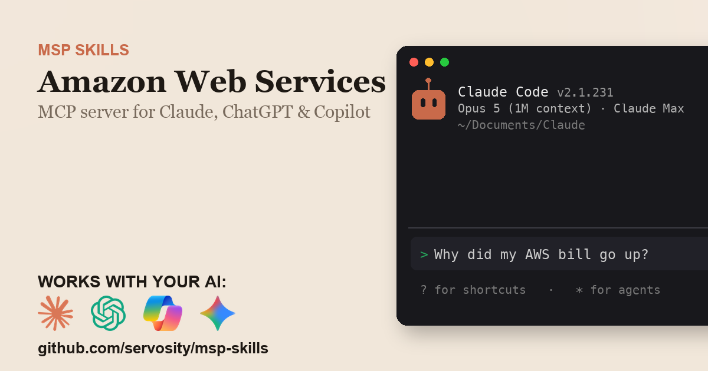

# Amazon Web Services + AI - for ChatGPT, Claude, GitHub Copilot, Microsoft 365 Copilot, Gemini, and any agent that speaks MCP

> Unofficial. Community-built Claude Code Skill and MCP server for the Amazon Web Services
> API. Not affiliated with, endorsed by, or sponsored by Amazon.com, Inc. or its affiliates.

<!-- media:start -->
<p align="center">
  <a href="https://msp-skills.compoundingteams.com/skills/aws-billing/">
    
  </a>
</p>
<p align="center"><sub><a href="https://msp-skills.compoundingteams.com/skills/aws-billing/">Full skill page</a> - install, outcomes, safety model.</sub></p>
<!-- media:end -->

Get a non-expert from zero to a Slack-delivered, plain-English, waste-flagged AWS bill breakdown  -  and cache it so you don't pay per Cost Explorer call. Works with the AI you already use - **ChatGPT** (Plus/Pro+), **Claude Desktop**, **Codex**, **Claude Code**, **Claude Cowork**, and **GitHub Copilot** - plus **Microsoft 365 Copilot / Copilot Studio** and **Google Gemini** via the remote path. Free, open source, runs on your laptop. Built for MSP owners. No code required.

## Works with your agent

The six agents MSP owners actually use (self-serve, works today):

| Your AI agent | How to install the Amazon Web Services skill |
| --- | --- |
| **Claude Desktop** | Run installer, then **Settings > Extensions** to register `aws-billing-mcp` (no JSON editing). |
| **ChatGPT** (paid plans) | Run installer, expose `aws-billing-mcp` over HTTPS, register as a Developer Mode connector. |
| **Codex CLI** | Paste the install prompt below. |
| **Claude Code** | Paste the install prompt below. |
| **Claude Cowork** | Paste the install prompt below. |
| **GitHub Copilot** (VS Code) | Run installer, add `aws-billing-mcp` to `mcp.json` under the `servers` key, then pick **Agent** mode. |

For ChatGPT, the Amazon Web Services MCP server is stdio - to use it with ChatGPT you expose it over HTTPS via the `mcp-remote` bridge or your own endpoint. See [mcp-install.md](./mcp-install.md).

### Also for the Microsoft and Google stacks

Big install base, but an honest heads-up: these are the **remote / enterprise** path, not the local binary you just installed.

| Agent | What it takes |
| --- | --- |
| **Microsoft 365 Copilot / Copilot Studio** | **Not self-serve.** Host `aws-billing-mcp` over HTTPS, then wire it into Copilot Studio (**Tools > Add a tool > Model Context Protocol > Server URL**) or a declarative agent. Needs a Copilot Studio license + tenant admin. See [mcp-install.md](./mcp-install.md). |
| **Google Gemini** | **Gemini CLI** is local - same as Claude Code. The **Gemini app** is remote - same HTTPS path as ChatGPT. See [mcp-install.md](./mcp-install.md). |

> **Skill-native agents (also covered):** [Hermes](https://hermes-agent.nousresearch.com) and [OpenClaw](#install-for-openclaw) read this skill's `SKILL.md` directly *and* speak MCP - see their install sections below. Also works with Cursor, Windsurf, Cline, Continue.dev, and Zed via MCP. Full per-tool wire-up: **[docs/which-agent.md](../../docs/which-agent.md)**.

> **Run more than one agent?** Install across all 51+ supported agents in one command: `npx skills add Servosity/msp-skills@latest` (requires Node.js, then run the per-skill installer for the CLI/MCP binaries). See [docs/which-agent.md](../../docs/which-agent.md#install-across-all-your-agents-at-once).

## Install in 60 seconds

### Fastest for Claude Desktop - one-click `.mcpb`

[**Download Amazon Web Services MCP (.mcpb)**](https://github.com/servosity/msp-skills/releases/download/aws-billing-v0.1.1/aws-billing-mcp.mcpb) - then open **Claude Desktop > Settings > Extensions** and select the file. One click, no JSON, no shell. (Browse every Amazon Web Services release on the [releases page](https://github.com/servosity/msp-skills/releases?q=aws-billing).)

Prefer the Claude Code plugin? Add the marketplace once, then install - works immediately, no directory listing required:

```
/plugin marketplace add Servosity/msp-skills
/plugin install aws-billing@msp-skills
```

### Path A - paste one prompt into your AI agent (recommended)

Copy this into **Claude Code**, **Codex CLI**, or **Claude Cowork**:

> Install the Amazon Web Services Skill and MCP server from Servosity/msp-skills in this agent workspace. If this workspace uses a POSIX shell (macOS, Linux, WSL, or Bash), run `bash <(curl -fsSL https://raw.githubusercontent.com/Servosity/msp-skills/main/skills/aws-billing/install.sh)`. If it uses Windows PowerShell, run `iwr -useb https://raw.githubusercontent.com/Servosity/msp-skills/main/skills/aws-billing/install.ps1 | iex`. Then authenticate per the README and run `aws-billing-cli --help` to explore.

The same prompt works in any agent that can run shell.

### Path B - run the installer yourself

**Windows (PowerShell):**

```powershell
iwr -useb https://raw.githubusercontent.com/Servosity/msp-skills/main/skills/aws-billing/install.ps1 | iex
```

**macOS / Linux:**

```bash
bash <(curl -fsSL https://raw.githubusercontent.com/Servosity/msp-skills/main/skills/aws-billing/install.sh)
```

The installer drops both `aws-billing-cli` (the CLI) and `aws-billing-mcp` (the MCP server) into your user bin path. Claude Code, Codex, and Cowork discover the Skill via `SKILL.md` in this directory.

Verify:

```bash
aws-billing-cli --version
```

### Upgrade to the latest version

The installer always fetches the current release - re-run it to upgrade:

**macOS / Linux:**

```bash
bash <(curl -fsSL https://raw.githubusercontent.com/Servosity/msp-skills/main/skills/aws-billing/install.sh)
```

**Windows (PowerShell):**

```powershell
iwr -useb https://raw.githubusercontent.com/Servosity/msp-skills/main/skills/aws-billing/install.ps1 | iex
```

Claude Desktop `.mcpb` users: download the latest `.mcpb` (top of this section) and re-select it in **Settings > Extensions**. Claude Code plugin users: `/plugin update aws-billing@msp-skills`.

### Add to Claude Desktop, GitHub Copilot, Gemini CLI, Microsoft 365 Copilot, or another MCP client

After the installer runs, see **[mcp-install.md](./mcp-install.md)** and **[docs/which-agent.md](../../docs/which-agent.md)** for the per-agent wire-up - one section per agent, including the GitHub Copilot `servers` key and the remote Microsoft 365 Copilot / Copilot Studio path. Claude Desktop's Settings > Extensions panel is the simplest path; the MCP config block (for users who prefer editing JSON) is documented in mcp-install.md.

<!-- pp-hermes-install-anchor -->
### Install for Hermes

From the Hermes CLI:

```bash
hermes skills install servosity/msp-skills/skills/aws-billing --force
```

Inside a Hermes chat session:

```
/skills install servosity/msp-skills/skills/aws-billing --force
```

Hermes [speaks MCP natively](https://hermes-agent.nousresearch.com), so it can also use the `aws-billing-mcp` server directly - same install path, same env vars.

### Install for OpenClaw

Tell your OpenClaw agent (copy this):

> Install the aws-billing skill from https://github.com/servosity/msp-skills/tree/main/skills/aws-billing. The skill defines how its required CLI (`aws-billing-cli`) can be installed via the `openclaw:` frontmatter block.

OpenClaw isn't generally available yet; the frontmatter wiring is pre-shipped and will activate the moment OpenClaw launches.

### Authenticate

See [mcp-install.md](./mcp-install.md) for the credentials `aws-billing-cli` needs.


## What this skill does

| Question your MSP keeps asking | Command |
| --- | --- |
| Why did my bill change month-over-month? | `aws-billing-cli compare --from last-month --to this-month` |
| Which linked account is driving org spend? | `aws-billing-cli consolidated --period this-month` |
| Where am I wasting money right now? | `aws-billing-cli waste rank` |
| Where is my data-transfer cost leaking? | `aws-billing-cli waste transfer --period last-month` |
| What does this cryptic usage-type line mean? | `aws-billing-cli explain EUC1-DataTransfer-Out-Bytes` |
| What will I spend next month? | `aws-billing-cli forecast --profile-aws prod` |
| How do I give a colleague read-only billing access? | `aws-billing-cli iam-setup --tier core --format cloudformation` |
| What's a plain answer about my bill? | `aws-billing-cli ask "what are my top services"` |

Full command reference: [guide.md](./guide.md). For the AI-agent operating contract (`--agent`, `--dry-run`, when to confirm before mutating), see [AGENTS.md](./AGENTS.md).

## What makes this different

Most Amazon Web Services integrations and MCP servers proxy each question into a live Cost Explorer call. That's fine for one lookup - but each request costs $0.01, and it dies the moment you're asking "which of my linked accounts had the biggest cost jump this quarter, and what service drove it" across every account at once.

This skill syncs Amazon Web Services into a **local SQLite mirror** with full-text search. Aggregate questions become one local query: instant, offline, and the AI sees the ranked answer, not the raw data. Compound commands like `consolidated`, `compare`, and `waste rank` join across linked accounts, services, and resource inventory - work a stateless API wrapper can't do without paying per call.

## The pain this closes

On r/msp, the recurring AWS thread is some version of "the client's bill jumped and I can't tell them why." The console shows a wall of usage-type codes like `EUC1-DataTransfer-Out-Bytes`, and Cost Explorer answers the question you didn't ask - buy Reserved Instances - instead of the one you did: what moved, and where is money leaking? Corey Quinn's *Last Week in AWS* has built an audience on the premise that AWS billing is opaque by design. For an MSP managing AWS for clients, that opacity is a monthly tax: the cost review gets skipped because nobody can read the bill, and the waste compounds until the number is already a surprise.

This skill closes that with a handful of high-leverage commands:

- `aws-billing-cli compare` - ranks the services that moved month-over-month, so "why did it change?" is a sentence, not a spreadsheet.
- `aws-billing-cli consolidated` - resolves every linked account by name with an inline delta, so you can name the account driving org spend in one view.
- `aws-billing-cli waste rank` - one dollar-ranked table of idle EC2, unattached EBS, orphaned snapshots, and unassociated Elastic IPs, with a grand total you could save.
- `aws-billing-cli waste transfer` - names where cross-AZ, cross-region, and NAT-gateway data-transfer cost is leaking.
- `aws-billing-cli explain` - decodes an opaque usage-type string into plain English.

See [pain-point.md](./pain-point.md) for the longer narrative.

## Frequently asked questions

### Does this work with ChatGPT?

Yes, on **Plus, Pro, Team, Business, Enterprise, and Education** plans (Free tier does not yet expose Developer Mode). ChatGPT connects to **remote** MCP servers over HTTPS, not local stdio binaries. The Amazon Web Services MCP server is local, so for ChatGPT you expose it via the `mcp-remote` bridge or your own HTTPS endpoint. Step-by-step in [mcp-install.md](./mcp-install.md).

### Does this work with Codex, Cursor, Windsurf, Cline, Copilot, or Gemini?

Yes - all of them speak MCP. Cross-tool install commands are in the matrix above and the deep-dive in [docs/which-agent.md](../../docs/which-agent.md).

### Do I need to know how to code?

No. The recommended install is to paste one sentence into Claude Code or Codex - your agent reads `SKILL.md` and does the install. The fallback is a one-line installer per OS (bash or PowerShell). Neither path requires writing code. You'll enter your Amazon Web Services credentials once.

### Is my Amazon Web Services data safe?

Your data stays on **your machine**. The CLI and MCP server are local binaries. The SQLite mirror sits in a directory under your user account. The AI agent only sees what the CLI returns - typically a query result, not raw bulk data. Credentials are read from your environment or your agent's config; never bundled into this repo or transmitted anywhere by MSP Skills.

### Will this run up my Cost Explorer bill?

No - that's the point of the local cache. `sync` pulls your cost data once (each Cost Explorer request is about $0.01), then `bill`, `compare`, `consolidated`, `waste`, and `ask` answer from the local SQLite mirror for free. Pass `--data-source live` only when you want a fresh pull.

### Do I need the `aws` CLI installed?

No. The binary signs its own AWS requests (SigV4) using the native credential chain - environment variables, a shared `--profile-aws`, SSO, assume-role, or instance metadata. There's nothing to paste and no `aws` CLI dependency.

### Does it work from a member account, or only the payer?

Org-wide cost data (the `consolidated` rollup) needs a management/payer-account profile; from a member account you see only that account's own costs. Resource-level waste scans work in any account. Run `aws-billing-cli doctor` to see exactly what your credentials can reach.

### Can it change anything in my AWS account?

No. Every command is read-only against the AWS billing & Cost Explorer API - it never stops, deletes, modifies, or buys anything. `waste gp2-gp3` even prints the `aws ec2 modify-volume` command you would run rather than running it. The opt-in outbound network actions are `report --post-slack` (posts a summary to Slack), `feedback --send` (sends a feedback note upstream, and only if you set `AWS_BILLING_FEEDBACK_ENDPOINT`), and `--deliver webhook:<url>` (POSTs a command's output to a URL you name) - none of them changes anything in AWS, and even the generic `import` command can't, because the billing API exposes no write endpoint.

### What does it cost?

Free. Apache-2.0 licensed. You pay only for whichever AI agent you use (Claude, ChatGPT, Codex, etc.), and that's billed by your AI provider, not by us.

## Safety model

| Tier | Examples | Recommended agent policy |
| --- | --- | --- |
| Read | `bill`, `consolidated`, `compare`, `forecast`, `waste rank`, `waste transfer`, `ask`, `explain`, `dimensions`, `doctor`, `iam-setup` | Allow |
| Write (local) | `sync` (writes the local cache), `report` (writes an HTML/PDF file) | Allow; never mutates AWS |
| Outbound (opt-in) | `report --post-slack` (Slack post), `feedback --send` (upstream note, only if you set an endpoint), `--deliver webhook:<url>` (POSTs output to a URL you name) | Allow; each fires only when you pass the flag |
| Destructive / config | none - the CLI never stops, deletes, modifies, or purchases any AWS resource | N/A |

The strongest control is the **scope you grant the Amazon Web Services credentials** - the CLI can only do what the credentials are permitted to do. Full details, including how to lock it down, are in [governance.md](./governance.md).

## Status

Beta. Validated against the Amazon Web Services API surface and being validated with MSPs running it live against their own production tenant in our weekly Build Sessions. RSVP at [compoundingteams.com/build-sessions](https://compoundingteams.com/build-sessions).

---

**Standards.** Conforms to the open [Agent Skills spec](https://agentskills.io) (Anthropic, Dec 2025; 40+ agents). MCP-compatible - works with any MCP-capable agent including [Hermes](https://hermes-agent.nousresearch.com). OpenClaw-ready (frontmatter pre-wired, awaiting OpenClaw launch).

Maintained by [Servosity](https://www.servosity.com). Apache-2.0 licensed. Built with [CLI Printing Press](https://github.com/mvanhorn/cli-printing-press). _Last updated: 2026-06-30._
