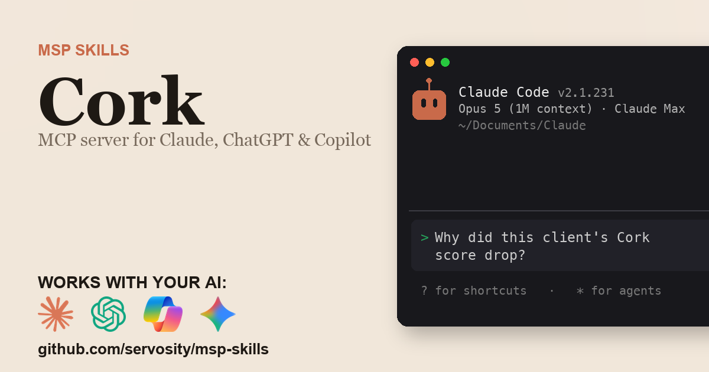

# Cork + AI - for ChatGPT, Claude, GitHub Copilot, Microsoft 365 Copilot, Gemini, and any agent that speaks MCP

> Unofficial. Community-built Claude Code Skill and MCP server for the Cork
> API. Not affiliated with, endorsed by, or sponsored by Cork.
> Cork and Cork Vantage are trademarks of Cork Protection, Inc.

<!-- media:start -->
<p align="center">
  <a href="https://msp-skills.compoundingteams.com/skills/cork/">
    
  </a>
</p>
<!-- media:end -->

Every Cork API operation, plus cross-client risk attribution, exploitability-first vulnerability triage, overdue-compliance detection, and stale-connector health checks that a stateless API mirror cannot answer in a single call. Works with the AI you already use - **ChatGPT** (Plus/Pro+), **Claude Desktop**, **Codex**, **Claude Code**, **Claude Cowork**, and **GitHub Copilot** - plus **Microsoft 365 Copilot / Copilot Studio** and **Google Gemini** via the remote path. Free, open source, runs on your laptop. Built for MSP owners. No code required.

## Works with your agent

The six agents MSP owners actually use (self-serve, works today):

| Your AI agent | How to install the Cork skill |
| --- | --- |
| **Claude Desktop** | Run installer, then **Settings > Extensions** to register `cork-mcp` (no JSON editing). |
| **ChatGPT** (paid plans) | Run installer, expose `cork-mcp` over HTTPS, register as a Developer Mode connector. |
| **Codex CLI** | Paste the install prompt below. |
| **Claude Code** | Paste the install prompt below. |
| **Claude Cowork** | Paste the install prompt below. |
| **GitHub Copilot** (VS Code) | Run installer, add `cork-mcp` to `mcp.json` under the `servers` key, then pick **Agent** mode. |

For ChatGPT, the Cork MCP server is stdio - to use it with ChatGPT you expose it over HTTPS via the `supergateway` bridge or your own endpoint. See [mcp-install.md](./mcp-install.md).

### Also for the Microsoft and Google stacks

Big install base, but an honest heads-up: these are the **remote / enterprise** path, not the local binary you just installed.

| Agent | What it takes |
| --- | --- |
| **Microsoft 365 Copilot / Copilot Studio** | **Not self-serve.** Host `cork-mcp` over HTTPS, then wire it into Copilot Studio (**Tools > Add a tool > Model Context Protocol > Server URL**) or a declarative agent. Needs a Copilot Studio license + tenant admin. See [mcp-install.md](./mcp-install.md). |
| **Google Gemini** | **Gemini CLI** is local - same as Claude Code. The **Gemini app** is remote - same HTTPS path as ChatGPT. See [mcp-install.md](./mcp-install.md). |

> **Skill-native agents (also covered):** [Hermes](https://hermes-agent.nousresearch.com) and [OpenClaw](#install-for-openclaw) read this skill's `SKILL.md` directly *and* speak MCP - see their install sections below. Also works with Cursor, Windsurf, Cline, Continue.dev, and Zed via MCP. Full per-tool wire-up: **[docs/which-agent.md](../../docs/which-agent.md)**.

> **Run more than one agent?** Install across all 51+ supported agents in one command: `npx skills add Servosity/msp-skills@latest` (requires Node.js, then run the per-skill installer for the CLI/MCP binaries). See [docs/which-agent.md](../../docs/which-agent.md#install-across-all-your-agents-at-once).

## Install in 60 seconds

Prefer the Claude Code plugin? Add the marketplace once, then install:

```
/plugin marketplace add Servosity/msp-skills
/plugin install cork@msp-skills
```

### Path A - paste one prompt into your AI agent (recommended)

Copy this into **Claude Code**, **Codex CLI**, or **Claude Cowork**:

> Install the Cork Skill and MCP server from Servosity/msp-skills in this agent workspace. If this workspace uses a POSIX shell (macOS, Linux, WSL, or Bash), run `bash <(curl -fsSL https://raw.githubusercontent.com/Servosity/msp-skills/main/skills/cork/install.sh)`. If it uses Windows PowerShell, run `iwr -useb https://raw.githubusercontent.com/Servosity/msp-skills/main/skills/cork/install.ps1 | iex`. Then authenticate per the README and run `cork-cli --help` to explore.

The same prompt works in any agent that can run shell.

### Path B - run the installer yourself

**Windows (PowerShell):**

```powershell
iwr -useb https://raw.githubusercontent.com/Servosity/msp-skills/main/skills/cork/install.ps1 | iex
```

**macOS / Linux:**

```bash
bash <(curl -fsSL https://raw.githubusercontent.com/Servosity/msp-skills/main/skills/cork/install.sh)
```

The installer drops both `cork-cli` (the CLI) and `cork-mcp` (the MCP server) into your user bin path. Claude Code, Codex, and Cowork discover the Skill via `SKILL.md` in this directory.

Verify:

```bash
cork-cli --version
```

### Upgrade to the latest version

The installer always fetches the current release - re-run it to upgrade:

**macOS / Linux:**

```bash
bash <(curl -fsSL https://raw.githubusercontent.com/Servosity/msp-skills/main/skills/cork/install.sh)
```

**Windows (PowerShell):**

```powershell
iwr -useb https://raw.githubusercontent.com/Servosity/msp-skills/main/skills/cork/install.ps1 | iex
```

Claude Code plugin users: `/plugin update cork@msp-skills`.

### Add to Claude Desktop, GitHub Copilot, Gemini CLI, Microsoft 365 Copilot, or another MCP client

After the installer runs, see **[mcp-install.md](./mcp-install.md)** and **[docs/which-agent.md](../../docs/which-agent.md)** for the per-agent wire-up - one section per agent, including the GitHub Copilot `servers` key and the remote Microsoft 365 Copilot / Copilot Studio path. Claude Desktop's Settings > Extensions panel is the simplest path; the MCP config block (for users who prefer editing JSON) is documented in mcp-install.md.

<!-- pp-hermes-install-anchor -->
### Install for Hermes

From the Hermes CLI:

```bash
hermes skills install servosity/msp-skills/skills/cork --force
```

Inside a Hermes chat session:

```
/skills install servosity/msp-skills/skills/cork --force
```

Hermes [speaks MCP natively](https://hermes-agent.nousresearch.com), so it can also use the `cork-mcp` server directly - same install path, same env vars.

### Install for OpenClaw

Tell your OpenClaw agent (copy this):

> Install the cork skill from https://github.com/servosity/msp-skills/tree/main/skills/cork. The skill defines how its required CLI (`cork-cli`) can be installed via the `openclaw:` frontmatter block.

OpenClaw isn't generally available yet; the frontmatter wiring is pre-shipped and will activate the moment OpenClaw launches.

### Authenticate

Set the API key the CLI needs (Cork portal > Settings > API Keys):

```bash
export CORK_API_KEY=<your key>
cork-cli doctor
```

`doctor` confirms the credentials work before you run anything that touches data. It exits 0 even when the credential is rejected, so scripts should add `--fail-on error`.

One property of Cork keys is worth knowing up front: **an API key inherits the permissions of the user who created it.** A 403 on the distributor or integration endpoints usually means the key was minted by an operator without that scope, not that the key is wrong. That property is also your best control - mint a read-only key for read-only work. See [governance.md](./governance.md).

### Sync before you ask

`search`, `score regressions`, and the client-roster lookups inside several other commands read a local mirror. Populate it once:

```bash
cork-cli sync
```

`sync` is read-only against the Cork API (GET requests only) and writes to a SQLite file under your own user account. Re-run it whenever you want fresher data; commands tell you when the mirror is stale rather than answering from data you did not expect.

## What this skill does

| Question your MSP keeps asking | Command |
| --- | --- |
| Why did this client's risk score move, and which component drove it? | `cork-cli score attribute <client-uuid> --since 30d` |
| Which clients across the whole book slipped the most this week? | `cork-cli score regressions --since 7d` |
| What should we patch first, ranked by what is actually being exploited? | `cork-cli vulnerabilities triage` |
| An advisory just named a CVE. Are we exposed, and where? | `cork-cli vulnerabilities exposure CVE-2023-21608` |
| Which compliance events have blown their remediation window? | `cork-cli compliance overdue` |
| Which connectors report healthy but stopped syncing? | `cork-cli integrations health` |
| Did this client get fully monitored after onboarding? | `cork-cli coverage gaps --client <client-uuid>` |
| Which unwarranted clients are carrying the most risk? | `cork-cli warranties exposure` |
| Is my auth and connectivity actually working? | `cork-cli doctor` |

Full command reference: [guide.md](./guide.md). For the AI-agent operating contract (`--agent`, `--dry-run`, when to confirm before mutating), see [AGENTS.md](./AGENTS.md).

## What makes this different

Cork's own tooling is a stateless mirror of its REST API: it answers one client, right now. Every question an MSP actually asks is cross-client, cross-time, or both, and **the Cork API exposes no cross-client aggregate endpoint at all**, so the live path for any of them is a fan-out across every client with no stored yesterday to compare against.

This skill syncs Cork into a **local SQLite mirror** and does the fan-out and the joining for you, so "the risk score dropped" becomes "the risk score dropped *because* compliance moved, and here are the overdue events behind it" - one command instead of a per-client walk you assemble by hand.

Only `score regressions` answers purely from the local mirror. The other seven fetch from the Cork API on every run, because the rows they need carry no id that can be mirrored - vulnerability findings, compliance events, connector state, and score history. Several of them do use the mirror for the client roster so they can skip a live `/clients` fan-out, and fall back to a live roster scan when the mirror is empty. Every one of them caps its own scan and prints when a sweep was truncated, instead of reporting a false all-clear.

## The pain this closes

- A score drops eleven points between QBRs. Cork returns the four components per timestamp but never differences them, so someone exports two snapshots and subtracts by hand. `cork-cli score attribute` does the subtraction and ranks the cause.
- "Which clients got worse this week" has no endpoint. `cork-cli score regressions` answers it as one local query.
- The vulnerability endpoint's server-side `sort_by` accepts only `sw_vendor` and `sw_product`, so exploitability ordering is impossible upstream. `cork-cli vulnerabilities triage` ranks known-exploited first, then EPSS, then CVSS, with a blast-radius device count.
- `cve_id` exists only nested inside `cves[]` and no endpoint accepts a CVE filter at any page size. `cork-cli vulnerabilities exposure` answers "are we exposed to this one" directly.
- A connector reports `connection_status: ok` while `last_synced_at` is days old. Both fields ship in the same payload and nothing compares the timestamp to now. `cork-cli integrations health` catches the green-but-dead connector.

See [pain-point.md](./pain-point.md) for the longer narrative.

## Frequently asked questions

### Does this work with ChatGPT?

Yes, on **Plus, Pro, Team, Business, Enterprise, and Education** plans (Free tier does not yet expose Developer Mode). ChatGPT connects to **remote** MCP servers over HTTPS, not local stdio binaries. The Cork MCP server is local, so for ChatGPT you expose it via the `supergateway` bridge or your own HTTPS endpoint. Step-by-step in [mcp-install.md](./mcp-install.md).

### Does this work with Codex, Cursor, Windsurf, Cline, Copilot, or Gemini?

Yes - all of them speak MCP. Cross-tool install commands are in the matrix above and the deep-dive in [docs/which-agent.md](../../docs/which-agent.md).

### Do I need to know how to code?

No. The recommended install is to paste one sentence into Claude Code or Codex - your agent reads `SKILL.md` and does the install. The fallback is a one-line installer per OS (bash or PowerShell). Neither path requires writing code. You'll enter your Cork API key once.

### Is my Cork data safe?

Your data stays on **your machine**. The CLI and MCP server are local binaries, and the MCP server speaks stdio only - it opens no network listener. The SQLite mirror sits in a directory under your user account. The AI agent only sees what the CLI returns - typically a query result, not raw bulk data. Credentials are read from your environment or your agent's config; never bundled into this repo or transmitted anywhere by MSP Skills.

### Will this hit my Cork API rate limits?

Partly. `sync` fills a local SQLite mirror, and `search` and `score regressions` answer from it without touching the API. `export` is NOT one of them - it paginates the live API and is one of the heaviest readers here, so pass `--limit` unless you mean to pull everything. The other seven analysis commands fetch live on every run, and two of them fan out - `coverage gaps` per connector, `compliance overdue` per client - so those are the ones to watch. Each caps its own scan (`--max-clients`, `--max-connectors`, `--max-scan-pages`) and tells you when it truncated. Cork publishes no rate limits, which is exactly why those caps exist.

### Why does my Cork key get a 403 on some commands?

A Cork API key inherits the permissions of the user who created it. A 403 on the distributor or integration endpoints usually means the key was minted by an operator without that scope, not that the key is wrong.

### Will this replace the Cork portal?

No, it complements it. The portal is still where you configure integrations and watch a single client. This skill answers the cross-client questions the portal makes you click through - score attribution, regression ranking, exploitability triage, stale connectors, coverage gaps - from your AI.

### What does it cost?

Free. Apache-2.0 licensed. You pay only for whichever AI agent you use (Claude, ChatGPT, Codex, etc.), and that's billed by your AI provider, not by us.

## Safety model

| Tier | Examples | Recommended agent policy |
| --- | --- | --- |
| Read | `score attribute`, `score regressions`, `vulnerabilities triage`, `vulnerabilities exposure`, `compliance overdue`, `integrations health`, `coverage gaps`, `warranties exposure`, `sync`, `search`, `export`, every `list` / `get` **except the secret-returning reads below** | Allow |
| Write (routine) | `integrations connect`, `integrations update`, `integrations resync integration` | Preview with `--dry-run`, then a reviewed write |
| Credential / security | `integrations credentials`, `integrations credentials get-integration` (printed verbatim, not redacted), `integrations raw-data get-integration` (returns a presigned URL that downloads the connector's full raw data with no further auth), and the credential fields of `integrations update` | Human-in-the-loop only, never in a blanket allow-all-reads policy |
| Destructive / endpoint-affecting | `integrations delete`, `software install` (installs a package on a real customer device through its RMM integration) | Human-in-the-loop only, explicit confirmation |
| Admin | `distributor provision-partner` | Operator-only, not for agents |
| Bulk write | `import <resource> --input file.jsonl` - one POST per line into the write endpoints above, continuing past failures | Human-in-the-loop only, explicit confirmation. Never unattended |

Three of those reach outside Cork itself: `software install` changes the state of a real customer machine, `distributor provision-partner` creates a partner account, and `import` runs either of those endpoints in bulk, one POST per line. Treat them like a manual RMM push or a commercial change, with the approval you already require for those.

The strongest control is the **scope you grant the Cork API key** - the CLI can only do what the key's creating user is permitted to do. Full details, including how to lock it down, are in [governance.md](./governance.md).

## Status

Beta. The full command surface has been exercised live, read-only, against a production Cork tenant: auth and connectivity, a complete `sync`, all eight cross-client analysis commands, typed exit codes on a missing resource, and the MCP stdio handshake. Mutating commands were run under `--dry-run` only; no write call was made against the tenant. Being validated further with MSPs running it against their own tenants in our weekly Build Sessions. RSVP at [compoundingteams.com/build-sessions](https://compoundingteams.com/build-sessions).

---

**Standards.** Conforms to the open [Agent Skills spec](https://agentskills.io) (Anthropic, Dec 2025; 40+ agents). MCP-compatible - works with any MCP-capable agent including [Hermes](https://hermes-agent.nousresearch.com). OpenClaw-ready (frontmatter pre-wired, awaiting OpenClaw launch).

Maintained by [Servosity](https://www.servosity.com). Apache-2.0 licensed. Built with [CLI Printing Press](https://github.com/mvanhorn/cli-printing-press). _Last updated: 2026-08-14._
