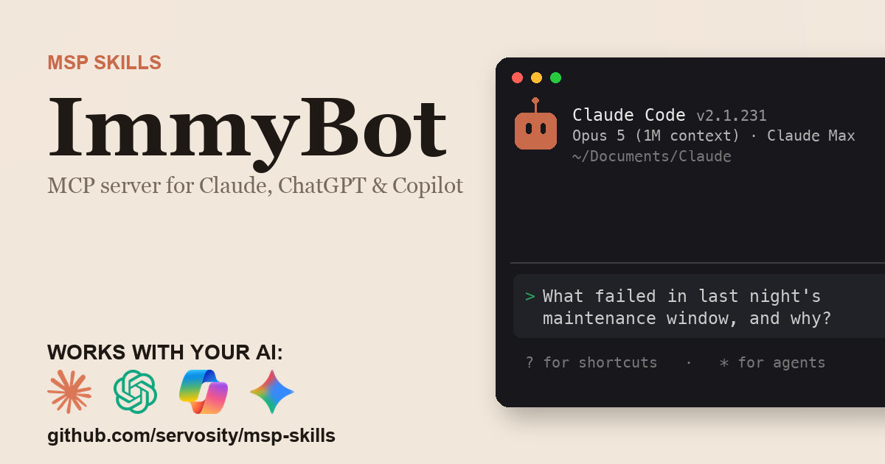

# ImmyBot CLI

> Unofficial. Community-built Claude Code Skill and MCP server for the ImmyBot
> API. Not affiliated with, endorsed by, or sponsored by ImmyBot, LLC.

<!-- media:start -->
<p align="center">
  <a href="https://msp-skills.compoundingteams.com/skills/immybot/">
    
  </a>
</p>
<p align="center"><sub><a href="https://msp-skills.compoundingteams.com/skills/immybot/">Full skill page</a> - install, outcomes, safety model.</sub></p>
<!-- media:end -->

**Every ImmyBot endpoint typed, plus a local SQLite mirror that answers the cross-tenant questions the web UI cannot.**

ImmyBot's API is large and entirely per-tenant, so the questions MSPs actually ask span calls the web UI never joins. This CLI types the whole surface, mirrors it into local SQLite with full-text search, and adds commands built on that mirror: session-triage collapses a night of failures into distinct root causes, version-spread ranks one software title across every tenant with a real semver comparator, and assignment-explain shows which deployment rule actually won on a given machine.

Learn more at [ImmyBot](https://www.immy.bot).

Created by [@geekbrownbear](https://github.com/geekbrownbear) (Abhi Saini).

## Install

This CLI ships as a Claude Code Skill and MCP server in [Servosity/msp-skills](https://github.com/Servosity/msp-skills). The installer downloads the `immybot-cli` and `immybot-mcp` binaries into `~/.local/bin` (macOS / Linux) or `%LOCALAPPDATA%\Programs\msp-skills` (Windows). It does not register the skill with your agent and writes no MCP client config - see [mcp-install.md](./mcp-install.md) for that wire-up.

1. macOS / Linux:
   ```bash
   bash <(curl -fsSL https://raw.githubusercontent.com/Servosity/msp-skills/main/skills/immybot/install.sh)
   ```
2. Windows (PowerShell):
   ```powershell
   iwr -useb https://raw.githubusercontent.com/Servosity/msp-skills/main/skills/immybot/install.ps1 | iex
   ```
3. Verify: `immybot-cli --version`
4. Ensure `~/.local/bin` (macOS / Linux) or `%LOCALAPPDATA%\Programs\msp-skills` (Windows) is on `$PATH`.

If `--version` reports "command not found" after install, the install step did not put the binary on `$PATH`. Do not proceed until verification succeeds.

### Pre-built binary

Download a pre-built binary for your platform from the [latest release](https://github.com/Servosity/msp-skills/releases?q=immybot). On macOS, clear the Gatekeeper quarantine: `xattr -d com.apple.quarantine <binary>`. On Unix, mark it executable: `chmod +x <binary>`.

<!-- pp-hermes-install-anchor -->
## Install for Hermes

From the Hermes CLI:

```bash
hermes skills install Servosity/msp-skills/skills/immybot --force
```

Inside a Hermes chat session:

```bash
/skills install Servosity/msp-skills/skills/immybot --force
```

Hermes [speaks MCP natively](https://hermes-agent.nousresearch.com), so it can also use the `immybot-mcp` server directly - same install path, same environment variables. Restart the Hermes session or gateway if the newly installed skill is not visible immediately.

## Install for OpenClaw

Tell your OpenClaw agent (copy this):

> Install the immybot skill from https://github.com/Servosity/msp-skills/tree/main/skills/immybot. The skill defines how its required CLI (`immybot-cli`) can be installed via the `openclaw:` frontmatter block.

OpenClaw isn't generally available yet; the frontmatter wiring is pre-shipped and will activate the moment OpenClaw launches.

## Use with Claude Desktop

This CLI ships an [MCPB](https://github.com/modelcontextprotocol/mcpb) bundle - Claude Desktop's standard format for one-click MCP extension installs (no JSON config required).

To install:

1. Download the `.mcpb` for your platform from the [latest release](https://github.com/Servosity/msp-skills/releases?q=immybot).
2. Double-click the `.mcpb` file. Claude Desktop opens and walks you through the install.
3. Fill in `IMMYBOT_TENANT_ID` when Claude Desktop prompts you.

Requires Claude Desktop 1.0.0 or later. A bundle carries the five platform binaries the builder downloads - macOS (`darwin-arm64`, `darwin-amd64`), Linux (`linux-arm64`, `linux-amd64`) and Windows (`windows-amd64`). Windows on ARM is released as a standalone binary but is not bundled, so use the manual config below there.

> **Interim note:** check any `.mcpb` bundle before you trust it ([#287](https://github.com/Servosity/msp-skills/issues/287)). Its `manifest.json` launches `${__dirname}/bin/immybot-mcp`, while the builder stores the release binaries in `bin/` under their platform-suffixed names - `immybot-mcp-darwin-arm64`, `-darwin-amd64`, `-linux-arm64`, `-linux-amd64`, `-windows-amd64.exe`. Run `unzip -l <file>.mcpb | grep bin/`: if the name the manifest launches is not among them, Claude Desktop has nothing to run - use the installer above and the manual JSON config below.

<details>
<summary>Manual JSON config (advanced)</summary>

If you can't use the MCPB bundle (older Claude Desktop, unsupported platform), install the MCP binary and configure it manually.


Install the MCP binary from this CLI's published public-library entry or pre-built release.

Add to your Claude Desktop config (`~/Library/Application Support/Claude/claude_desktop_config.json`):

```json
{
  "mcpServers": {
    "immybot": {
      "command": "immybot-mcp",
      "env": {
        "IMMYBOT_SUBDOMAIN": "<your-immybot-subdomain>",
        "IMMYBOT_TENANT_ID": "<your-entra-tenant-id>",
        "IMMYBOT_CLIENT_ID": "<your-entra-client-id>",
        "IMMYBOT_CLIENT_SECRET": "<your-entra-client-secret>"
      }
    }
  }
}
```

</details>

## Authentication

ImmyBot authenticates through Microsoft Entra ID rather than an ImmyBot-issued key. Register an app in Entra ID, create a client secret, then in ImmyBot go to Show More > People > New and paste the Enterprise Application's object ID into the AD External ID field, promoting that person to an admin user. The CLI then needs four values: IMMYBOT_SUBDOMAIN (your instance name without .immy.bot), IMMYBOT_TENANT_ID, IMMYBOT_CLIENT_ID, and IMMYBOT_CLIENT_SECRET. The client-credentials token is minted against login.microsoftonline.com and cached automatically; the API scope is derived from your instance URL, and IMMYBOT_OAUTH_SCOPE overrides it if your tenant exposes a different App ID URI.

## Quick Start

```bash
# Confirm the instance subdomain and Entra credentials resolve before anything else.
immybot-cli doctor

# Build the local mirror the cross-tenant commands read from.
immybot-cli sync --resources tenants,computers

# Confirm the mirror has real rows.
immybot-cli computers list --page-size 20

# Collapse the last maintenance window into distinct root causes.
immybot-cli session-triage --since 24h

# Answer the recurring question: which tenants are still behind on a title.
immybot-cli version-spread "Google Chrome" --min-version 140

```

## Unique Features

These capabilities aren't available in any other tool for this API.

### Local state that compounds
- **`session-triage`** - Group last night's failed maintenance actions by root cause instead of reading the same error on forty machines.

  _Reach for this first after any maintenance window: it turns N red machines into the handful of distinct problems actually worth a ticket._

  ```bash
  immybot-cli session-triage --since 24h --agent
  ```
- **`version-spread`** - Semver-ordered distribution of one software title across every tenant, flagging everything below a floor.

  _This is the CVE-response command: one call answers which clients are still exposed on a given title._

  ```bash
  immybot-cli version-spread "Google Chrome" --min-version 140 --agent
  ```
- **`fleet-diff`** - What actually changed between two syncs: computers added or removed, software versions moved, assignments modified.

  _Use this to answer "what changed since last night" without diffing two exports by hand._

  ```bash
  immybot-cli fleet-diff --since 24h --agent
  ```
- **`onboarding-stalled`** - Computers stuck waiting to onboard, bucketed by age and annotated with whether onboarding was ever attempted.

  _Surfaces machines that silently never finished onboarding, which is the failure mode clients notice first._

  ```bash
  immybot-cli onboarding-stalled --older-than 3d --agent
  ```

### Deployment resolution
- **`assignment-explain`** - Show every target assignment that resolves onto one computer, which scope matched, and which rules are shadowed.

  _Use this for any "why didn't this machine get X" question; it answers what a computer receives and why, which no single endpoint does._

  ```bash
  immybot-cli assignment-explain 4821 --agent
  ```
- **`script-blast-radius`** - Every maintenance task, software package, and computer that a script reaches before you edit it.

  _Run this before editing any shared script; it is the only way to see downstream reach across tenants._

  ```bash
  immybot-cli script-blast-radius 312 --agent
  ```

### Integration hygiene
- **`psa-reconcile`** - Diff the ImmyBot roster against a linked PSA or RMM asset roster to find unlinked computers and orphaned assets.

  _Run after each week of onboards and decommissions; mapping gaps otherwise surface as a wrong invoice or a machine that stopped getting maintenance._

  ```bash
  immybot-cli psa-reconcile --provider 7 --agent
  ```

## Recipes

### Morning triage in one call

```bash
immybot-cli session-triage --since 24h --agent --select clusters.reason,clusters.action,clusters.computer_count
```

Returns only the distinct failure causes and how many machines each hit, which is the whole decision surface for opening tickets.

### CVE sweep across every client

```bash
immybot-cli version-spread "Google Chrome" --min-version 140 --agent
```

Ranks installed versions with a real semver comparator and lists the tenants and machines still below the floor.

### Explain a missed deployment

```bash
immybot-cli assignment-explain 4821 --agent
```

Shows every target assignment resolving onto that computer, which scope matched, and which rules were shadowed.

### Check reach before editing a shared script

```bash
immybot-cli script-blast-radius 312 --agent
```

Walks the script to its consuming tasks and packages and out to the computers those assignments resolve onto.

### Find silently stalled onboards

```bash
immybot-cli onboarding-stalled --older-than 3d --agent
```

Buckets the onboarding queue by age and shows whether an onboarding session was ever attempted and how it ended.

## Usage

Run `immybot-cli --help` for the full command reference and flag list.

## Paths & environment variables

This CLI separates local files into four path kinds:

| Kind | Contents |
|------|----------|
| `config` | User-editable settings such as `config.toml` and saved profiles |
| `data` | Durable local data: `credentials.toml`, `data.db`, cookies, browser-session proof files, and other auth sidecars |
| `state` | Runtime state such as persisted queries, jobs, and `teach.log` |
| `cache` | Regenerable HTTP/cache files |

Each kind resolves independently. The ladder is:

1. Per-kind env var: `IMMYBOT_CONFIG_DIR`, `IMMYBOT_DATA_DIR`, `IMMYBOT_STATE_DIR`, or `IMMYBOT_CACHE_DIR`
2. `--home <dir>` for this invocation
3. `IMMYBOT_HOME` for a flat relocated root
4. XDG env vars: `XDG_CONFIG_HOME`, `XDG_DATA_HOME`, `XDG_STATE_HOME`, `XDG_CACHE_HOME`
5. Platform defaults matching existing installs

For containers and agent sandboxes, prefer a single relocated root:

```bash
export IMMYBOT_HOME=/srv/immybot
immybot-cli doctor
```

Under `IMMYBOT_HOME=/srv/immybot`, the four dirs resolve to `/srv/immybot/config`, `/srv/immybot/data`, `/srv/immybot/state`, and `/srv/immybot/cache`.

MCP servers do not receive CLI flags from the host. Put relocation in the host `env` block:

```json
{
  "mcpServers": {
    "immybot": {
      "command": "immybot-mcp",
      "env": {
        "IMMYBOT_HOME": "/srv/immybot"
      }
    }
  }
}
```

Precedence matters in fleets: an ambient per-kind variable such as `IMMYBOT_DATA_DIR` overrides an explicit `--home` for that kind. Use `IMMYBOT_HOME` or the per-kind variables for durable fleet relocation; treat `--home` as the weaker per-invocation lever.

Relocation is one-way. Unsetting `IMMYBOT_HOME` does not move files back to platform defaults, and `doctor` cannot find credentials left under a former root. Move the files manually before unsetting relocation variables.

Existing installs keep working because the platform-default rung matches the legacy layout. On the first auth write, stored secrets leave `config.toml` and are consolidated into `credentials.toml` under the data directory. Run `immybot-cli doctor --fail-on warn` to check path and credential-location warnings in automation.

## Commands

### access

Manage access

- **`immybot-cli access create-delete-azure-tenant-auth-details`** - Create delete azure tenant auth details
- **`immybot-cli access create-request`** - Create request
- **`immybot-cli access create-update-azure-tenant-auth-details`** - Create update azure tenant auth details
- **`immybot-cli access get-get-azure-tenant-auth-details-by-azure-tenant-principal-id`** - Get get azure tenant auth details by azure tenant principal id
- **`immybot-cli access get-get-ip-addresses`** - Get get ip addresses
- **`immybot-cli access get-me-permissions-by-permission-type-tenants`** - Get me permissions by permission type tenants
- **`immybot-cli access list`** - List

### application-locks

Manage application locks

- **`immybot-cli application-locks create-request-cancellation`** - Create request cancellation
- **`immybot-cli application-locks get-realtime-event-stream`** - Get realtime event stream
- **`immybot-cli application-locks list`** - List

### application-logs

Manage application logs

- **`immybot-cli application-logs create-source-context`** - Create source context
- **`immybot-cli application-logs create-source-context-clear`** - Create source context clear
- **`immybot-cli application-logs create-source-context-clear-all`** - Create source context clear all
- **`immybot-cli application-logs create-streaming`** - Create streaming
- **`immybot-cli application-logs get-source-contexts`** - Get source contexts

### audits

Manage audits

- **`immybot-cli audits get-global-dx`** - Get global dx
- **`immybot-cli audits get-local-dx`** - Get local dx

### azure

Manage azure

- **`immybot-cli azure create-disambiguate-tenant-type`** - Create disambiguate tenant type
- **`immybot-cli azure create-preconsent-customer-tenants`** - Create preconsent customer tenants
- **`immybot-cli azure create-sync-details-from-tenants`** - Create sync details from tenants
- **`immybot-cli azure create-sync-users-from-tenants`** - Create sync users from tenants
- **`immybot-cli azure create-tenant-consented`** - Create tenant consented
- **`immybot-cli azure get-app-registration-options`** - Get app registration options
- **`immybot-cli azure get-partner-tenant-customers-by-partner-principal-id`** - Get partner tenant customers by partner principal id
- **`immybot-cli azure get-partner-tenant-infos`** - Get partner tenant infos

### azure-errors

Manage azure errors

- **`immybot-cli azure-errors get-dx`** - Get dx
- **`immybot-cli azure-errors get-for-tenant-by-tenant-principal-id-dx`** - Get for tenant by tenant principal id dx

### billing

Manage billing

- **`immybot-cli billing create-cancel-subscription`** - Create cancel subscription
- **`immybot-cli billing create-information`** - Create information
- **`immybot-cli billing create-reactivate-subscription`** - Create reactivate subscription
- **`immybot-cli billing create-update-addon`** - Create update addon
- **`immybot-cli billing create-update-subscription`** - Create update subscription
- **`immybot-cli billing get-credit-cards`** - Get credit cards
- **`immybot-cli billing get-download-invoice`** - Get download invoice
- **`immybot-cli billing get-feature-usage-counts`** - Get feature usage counts
- **`immybot-cli billing get-information`** - Get information
- **`immybot-cli billing get-platform-details`** - Get platform details
- **`immybot-cli billing get-product-catalog`** - Get product catalog
- **`immybot-cli billing get-product-catalog-items`** - Get product catalog items
- **`immybot-cli billing get-subscription-details`** - Get subscription details

### brandings

Manage brandings

- **`immybot-cli brandings create`** - Create
- **`immybot-cli brandings create-global-default-by-id`** - Create global default by id
- **`immybot-cli brandings create-send-test-email`** - Create send test email
- **`immybot-cli brandings create-validate-time-format-by-time-format`** - Create validate time format by time format
- **`immybot-cli brandings delete-by-id`** - Delete by id
- **`immybot-cli brandings get-by-id`** - Get by id
- **`immybot-cli brandings get-support`** - Fetches support related branding changes to be used in the Support Sidebar, Session Support Request, or other Support related UI.
These branding changes can be specified by Dynamic Providers implementing 'ISupportsSupportTicketDetailOverride'
- **`immybot-cli brandings list`** - List
- **`immybot-cli brandings update-by-id`** - Update by id

### change-requests

Manage change requests

- **`immybot-cli change-requests delete-by-id`** - Delete by id
- **`immybot-cli change-requests get-dx`** - Get dx
- **`immybot-cli change-requests get-open-count`** - Get open count

### chocolatey

Manage chocolatey

- **`immybot-cli chocolatey get-find-packages-by-id`** - Get find packages by id
- **`immybot-cli chocolatey get-search`** - Get search

### computers

Manage computers

- **`immybot-cli computers create-add-tags`** - Create add tags
- **`immybot-cli computers create-bulk-delete`** - Create bulk delete
- **`immybot-cli computers create-change-tenant`** - Create change tenant
- **`immybot-cli computers create-remove-tags`** - Create remove tags
- **`immybot-cli computers create-restore`** - Create restore
- **`immybot-cli computers create-set-excluded-from-user-affinity`** - Create set excluded from user affinity
- **`immybot-cli computers create-skip-onboarding`** - Create skip onboarding
- **`immybot-cli computers get-agent-status`** - Get agent status
- **`immybot-cli computers get-by-id`** - Get by id
- **`immybot-cli computers get-dx`** - Get dx
- **`immybot-cli computers get-export`** - Get export
- **`immybot-cli computers get-inventory`** - Get inventory
- **`immybot-cli computers get-inventory-export`** - Get inventory export
- **`immybot-cli computers get-inventory-software-search-by-name`** - Get inventory software search by name
- **`immybot-cli computers get-inventory-software-search-by-upgrade-code`** - Get inventory software search by upgrade code
- **`immybot-cli computers get-my`** - Get my
- **`immybot-cli computers get-onboarding`** - Get onboarding
- **`immybot-cli computers get-paged`** - List computers with server-side paging, filtering, and sorting (skip/take)
- **`immybot-cli computers get-user-affinities`** - Get user affinities
- **`immybot-cli computers get-user-affinities-export`** - Get user affinities export
- **`immybot-cli computers list`** - List
- **`immybot-cli computers update-by-id`** - Update by id

### dynamic-provider-types

Manage dynamic provider types

- **`immybot-cli dynamic-provider-types create-global`** - Create global
- **`immybot-cli dynamic-provider-types create-global-by-id`** - Create global by id
- **`immybot-cli dynamic-provider-types create-global-by-id-reload`** - Create global by id reload
- **`immybot-cli dynamic-provider-types create-local`** - Create local
- **`immybot-cli dynamic-provider-types create-local-by-id`** - Create local by id
- **`immybot-cli dynamic-provider-types create-local-by-id-reload`** - Create local by id reload
- **`immybot-cli dynamic-provider-types create-reload`** - Create reload
- **`immybot-cli dynamic-provider-types create-test-environment-by-terminal-id`** - Create test environment by terminal id
- **`immybot-cli dynamic-provider-types create-test-environment-by-terminal-id-bind-configuration-form`** - Create test environment by terminal id bind configuration form
- **`immybot-cli dynamic-provider-types create-test-environment-by-terminal-id-execute-method-by-method`** - Create test environment by terminal id execute method by method
- **`immybot-cli dynamic-provider-types delete-global-by-id`** - Delete global by id
- **`immybot-cli dynamic-provider-types delete-local-by-id`** - Delete local by id
- **`immybot-cli dynamic-provider-types delete-test-environment-by-terminal-id`** - Delete test environment by terminal id
- **`immybot-cli dynamic-provider-types get-global-by-id`** - Get global by id
- **`immybot-cli dynamic-provider-types get-local-by-id`** - Get local by id
- **`immybot-cli dynamic-provider-types list`** - List

### effective-permissions

Manage effective permissions

- **`immybot-cli effective-permissions create-groups-by-group-id-evaluate-all-assignments`** - Returns all role assignments for a group grouped by permission without evaluation context.
Shows assignment overview without determining effective allow/deny.
- **`immybot-cli effective-permissions create-groups-by-group-id-evaluate-resource`** - Evaluates permissions for a group against a specific resource.
Determines effective allow/deny for each permission within that resource context.
- **`immybot-cli effective-permissions create-groups-by-group-id-evaluate-tenant`** - Evaluates permissions for a group against a specific tenant.
Determines effective allow/deny for each permission within that tenant context.
- **`immybot-cli effective-permissions create-users-by-user-id-evaluate-all-assignments`** - Returns all role assignments for a user grouped by permission without evaluation context.
Shows assignment overview without determining effective allow/deny.
- **`immybot-cli effective-permissions create-users-by-user-id-evaluate-resource`** - Evaluates permissions for a user against a specific resource.
Determines effective allow/deny for each permission within that resource context.
- **`immybot-cli effective-permissions create-users-by-user-id-evaluate-tenant`** - Evaluates permissions for a user against a specific tenant.
Determines effective allow/deny for each permission within that tenant context.

### ephemeral-session

Manage ephemeral session

- **`immybot-cli ephemeral-session get-by-agent-instance-id-by-provider-agent-id`** - Get by agent instance id by provider agent id
- **`immybot-cli ephemeral-session get-development-latest-ephemeral-binary`** - Get development latest ephemeral binary
- **`immybot-cli ephemeral-session get-development-latest-ephemeral-binary-v2`** - Get development latest ephemeral binary v2

### getting-started

Manage getting started

- **`immybot-cli getting-started create-checklist-complete`** - Create checklist complete
- **`immybot-cli getting-started create-checklist-reset`** - Create checklist reset
- **`immybot-cli getting-started get-checklist`** - Get checklist

### groups

Manage groups

- **`immybot-cli groups create`** - Create
- **`immybot-cli groups delete-by-id`** - Delete by id
- **`immybot-cli groups get-by-id`** - Get by id
- **`immybot-cli groups list`** - List
- **`immybot-cli groups update-by-id`** - Update by id

### immy-agent-metadata

Manage immy agent metadata

- **`immybot-cli immy-agent-metadata`** - Get agent hash

### installer

Manage installer

- **`immybot-cli installer`** - Create agent rekey request

### inventory-tasks

Manage inventory tasks

- **`immybot-cli inventory-tasks create-local`** - Create local
- **`immybot-cli inventory-tasks create-local-by-id`** - Create local by id
- **`immybot-cli inventory-tasks create-local-by-id-scripts`** - Create local by id scripts
- **`immybot-cli inventory-tasks delete-local-by-id`** - Delete local by id
- **`immybot-cli inventory-tasks delete-local-by-task-id-scripts-by-inventory-key`** - Delete local by task id scripts by inventory key
- **`immybot-cli inventory-tasks list`** - List

### licenses

Manage licenses

- **`immybot-cli licenses create`** - Create
- **`immybot-cli licenses create-upload`** - Create upload
- **`immybot-cli licenses delete-by-id`** - Delete by id
- **`immybot-cli licenses get-by-id`** - Get by id
- **`immybot-cli licenses get-dx`** - Get dx
- **`immybot-cli licenses list`** - List
- **`immybot-cli licenses update-by-id`** - Update by id

### maintenance-actions

Manage maintenance actions

- **`immybot-cli maintenance-actions create-latest-action-for-computers`** - Create latest action for computers
- **`immybot-cli maintenance-actions create-latest-action-for-tenants`** - Create latest action for tenants
- **`immybot-cli maintenance-actions get-computer-by-computer-id-needs-attention`** - Get computer by computer id needs attention
- **`immybot-cli maintenance-actions get-dx`** - Get dx
- **`immybot-cli maintenance-actions get-dx-for-computer-by-computer-id`** - Get dx for computer by computer id
- **`immybot-cli maintenance-actions get-latest-for-computer-by-computer-id`** - Get latest for computer by computer id
- **`immybot-cli maintenance-actions get-latest-for-tenant-by-tenant-id`** - Get latest for tenant by tenant id
- **`immybot-cli maintenance-actions get-latest-non-compliant-actions-for-tenant-by-tenant-id`** - Get latest non compliant actions for tenant by tenant id
- **`immybot-cli maintenance-actions get-maintenance-item`** - Get maintenance item
- **`immybot-cli maintenance-actions get-version`** - Get version

### maintenance-emails

Manage maintenance emails


### maintenance-sessions

Manage maintenance sessions

- **`immybot-cli maintenance-sessions create-cancel`** - Create cancel
- **`immybot-cli maintenance-sessions create-cancel-all`** - Create cancel all
- **`immybot-cli maintenance-sessions create-rerun-v2`** - Create rerun v2
- **`immybot-cli maintenance-sessions get-by-session-id`** - Get by session id
- **`immybot-cli maintenance-sessions get-cancel-for-schedule-by-schedule-id`** - Get cancel for schedule by schedule id
- **`immybot-cli maintenance-sessions get-dx`** - Get dx
- **`immybot-cli maintenance-sessions get-status-counts`** - Get status counts

### maintenance-tasks

Manage maintenance tasks

- **`immybot-cli maintenance-tasks create-duplicate`** - Create duplicate
- **`immybot-cli maintenance-tasks create-global`** - Create global
- **`immybot-cli maintenance-tasks create-global-by-id`** - Create global by id
- **`immybot-cli maintenance-tasks create-global-by-id-param-block-from-parameters`** - Create global by id param block from parameters
- **`immybot-cli maintenance-tasks create-local`** - Create local
- **`immybot-cli maintenance-tasks create-local-by-id`** - Create local by id
- **`immybot-cli maintenance-tasks create-local-by-id-migrate-local-to-global`** - Create local by id migrate local to global
- **`immybot-cli maintenance-tasks create-local-by-id-param-block-from-parameters`** - Create local by id param block from parameters
- **`immybot-cli maintenance-tasks create-validate-param-block-parameters`** - Create validate param block parameters
- **`immybot-cli maintenance-tasks delete-global-by-id`** - Delete global by id
- **`immybot-cli maintenance-tasks delete-local-by-id`** - Delete local by id
- **`immybot-cli maintenance-tasks get-global`** - Get global
- **`immybot-cli maintenance-tasks get-global-by-id`** - Get global by id
- **`immybot-cli maintenance-tasks get-local`** - Get local
- **`immybot-cli maintenance-tasks get-local-by-id`** - Get local by id
- **`immybot-cli maintenance-tasks get-local-by-id-migrate-local-to-global-what-if`** - Get local by id migrate local to global what if
- **`immybot-cli maintenance-tasks get-reference-count`** - Get reference count
- **`immybot-cli maintenance-tasks get-search`** - Get search

### me

Manage me

- **`immybot-cli me`** - Gets all role assignments and groups for the current user

### media

Manage media

- **`immybot-cli media create-global-by-id`** - Create global by id
- **`immybot-cli media create-global-upload`** - Create global upload
- **`immybot-cli media create-local-by-id`** - Create local by id
- **`immybot-cli media create-local-by-id-authorization`** - Create local by id authorization
- **`immybot-cli media create-local-upload`** - Create local upload
- **`immybot-cli media create-request-file-download-url`** - Create request file download url
- **`immybot-cli media create-support-upload`** - Create support upload
- **`immybot-cli media delete-global-by-id`** - Delete global by id
- **`immybot-cli media delete-local-by-id`** - Delete local by id
- **`immybot-cli media get-global`** - Get global
- **`immybot-cli media get-global-by-id`** - Get global by id
- **`immybot-cli media get-global-by-id-download-url`** - Get global by id download url
- **`immybot-cli media get-local`** - Get local
- **`immybot-cli media get-local-by-id`** - Get local by id
- **`immybot-cli media get-local-by-id-authorization`** - Get local by id authorization
- **`immybot-cli media get-local-by-id-download-url`** - Get local by id download url
- **`immybot-cli media get-search`** - Get search

### metrics

Manage metrics

- **`immybot-cli metrics create-circuit-breakers-isolate`** - Create circuit breakers isolate
- **`immybot-cli metrics create-circuit-breakers-reset`** - Create circuit breakers reset
- **`immybot-cli metrics get-circuit-breakers`** - Get circuit breakers
- **`immybot-cli metrics get-provider-links`** - Get provider links
- **`immybot-cli metrics get-provider-links-by-provider-link-id-rate-limit-statistics`** - Returns the current rate limiter statistics for a provider link.
200: stats available. 204: provider not initialized. 404: provider does not support rate limiting or link not found.

### notifications

Manage notifications

- **`immybot-cli notifications create-acknowledge`** - Create acknowledge
- **`immybot-cli notifications get-dx`** - Get dx
- **`immybot-cli notifications get-unacknowledged`** - Get unacknowledged
- **`immybot-cli notifications list`** - List

### oauth

Manage oauth

- **`immybot-cli oauth create-access-tokens-by-id-refresh`** - Create access tokens by id refresh
- **`immybot-cli oauth create-begin-auth-code-flow`** - Create begin auth code flow
- **`immybot-cli oauth create-fail-auth-code-flow`** - Create fail auth code flow
- **`immybot-cli oauth create-finish-auth-code-flow`** - Create finish auth code flow
- **`immybot-cli oauth delete-access-tokens-by-id`** - Delete access tokens by id
- **`immybot-cli oauth get-access-tokens`** - Get access tokens
- **`immybot-cli oauth get-access-tokens-by-id-by-access-token-id`** - Get access tokens by id by access token id

### persons

Manage persons

- **`immybot-cli persons create`** - Create
- **`immybot-cli persons create-add-tags`** - Create add tags
- **`immybot-cli persons create-remove-tags`** - Create remove tags
- **`immybot-cli persons delete-by-id`** - Delete by id
- **`immybot-cli persons get-by-id`** - Get by id
- **`immybot-cli persons get-dx`** - Get dx
- **`immybot-cli persons get-requesting-access`** - Get requesting access
- **`immybot-cli persons list`** - List
- **`immybot-cli persons update-by-id`** - Update by id

### plugins

Manage plugins

- **`immybot-cli plugins create-api-v1-by-provider-link-id-by-catch-all`** - Create api v1 by provider link id by catch all
- **`immybot-cli plugins get-api-v1-by-provider-link-id-by-catch-all`** - Get api v1 by provider link id by catch all
- **`immybot-cli plugins get-api-v1-by-provider-link-id-by-catch-all-v2`** - Get api v1 by provider link id by catch all v2

### preferences

Manage preferences

- **`immybot-cli preferences get-tenants-by-tenant-id`** - Get tenants by tenant id
- **`immybot-cli preferences list`** - List
- **`immybot-cli preferences update-application`** - Update application
- **`immybot-cli preferences update-my`** - Update my
- **`immybot-cli preferences update-tenants-by-tenant-id`** - Update tenants by tenant id

### provider-agents

Manage provider agents

- **`immybot-cli provider-agents create-bulk-delete-pending`** - Create bulk delete pending
- **`immybot-cli provider-agents create-identify`** - Identify agents that are marked with  requiring manual identification
- **`immybot-cli provider-agents create-resolve-failure-by-failure-id`** - Create resolve failure by failure id
- **`immybot-cli provider-agents create-resolve-failures`** - Create resolve failures
- **`immybot-cli provider-agents get-pending`** - Get pending
- **`immybot-cli provider-agents get-pending-counts`** - Get pending counts

### provider-links

Manage provider links

- **`immybot-cli provider-links create`** - Create
- **`immybot-cli provider-links create-create-with-external-provider-reference`** - Create create with external provider reference
- **`immybot-cli provider-links create-verify-with-external-provider-reference`** - Create verify with external provider reference
- **`immybot-cli provider-links delete-by-id`** - Delete by id
- **`immybot-cli provider-links get-by-id`** - Get by id
- **`immybot-cli provider-links list`** - List
- **`immybot-cli provider-links update-by-id`** - Update by id

### provider-types

Manage provider types

- **`immybot-cli provider-types get-client-group-types-by-client-group-type-id-client-groups`** - Get client group types by client group type id client groups
- **`immybot-cli provider-types get-device-group-types-by-device-group-type-id-device-groups`** - Get device group types by device group type id device groups
- **`immybot-cli provider-types get-form-dropdown-options-by-key`** - Get form dropdown options by key
- **`immybot-cli provider-types list`** - List

### rmm-links

Manage rmm links

- **`immybot-cli rmm-links create`** - Create
- **`immybot-cli rmm-links get-by-id`** - Get by id
- **`immybot-cli rmm-links list`** - List
- **`immybot-cli rmm-links update-by-id`** - Update by id

### roles

Manage roles

- **`immybot-cli roles create`** - Create
- **`immybot-cli roles delete-by-id`** - Delete by id
- **`immybot-cli roles get-by-id`** - Get by id
- **`immybot-cli roles get-permissions`** - Get permissions
- **`immybot-cli roles list`** - List
- **`immybot-cli roles update-by-id`** - Update by id

### run-immy-service

Manage run immy service

- **`immybot-cli run-immy-service`** - Create

### run-immy-service-new

Manage run immy service new

- **`immybot-cli run-immy-service-new`** - Create

### schedules

Manage schedules

- **`immybot-cli schedules create`** - Create
- **`immybot-cli schedules create-bulk-cancel`** - Create bulk cancel
- **`immybot-cli schedules create-bulk-delete`** - Create bulk delete
- **`immybot-cli schedules create-bulk-run-now`** - Create bulk run now
- **`immybot-cli schedules delete-by-id`** - Delete by id
- **`immybot-cli schedules get-by-id`** - Get by id
- **`immybot-cli schedules get-running-ids`** - Get running ids
- **`immybot-cli schedules list`** - List
- **`immybot-cli schedules update-bulk-update-status`** - Update bulk update status
- **`immybot-cli schedules update-by-id`** - Update by id

### scripts

Manage scripts

- **`immybot-cli scripts create-debug-cancel-by-cancellation-id`** - Create debug cancel by cancellation id
- **`immybot-cli scripts create-default-variables`** - Create default variables
- **`immybot-cli scripts create-does-have-param-block`** - Create does have param block
- **`immybot-cli scripts create-duplicate`** - Create duplicate
- **`immybot-cli scripts create-functions-syntax`** - Execute a cloud script that returns the syntax for a specific command
- **`immybot-cli scripts create-global`** - Create global
- **`immybot-cli scripts create-global-by-id`** - Create global by id
- **`immybot-cli scripts create-language-service-start`** - Create language service start
- **`immybot-cli scripts create-local`** - Create local
- **`immybot-cli scripts create-local-by-id`** - Create local by id
- **`immybot-cli scripts create-local-by-id-authorization`** - Create local by id authorization
- **`immybot-cli scripts create-local-by-id-migrate-local-to-global`** - Create local by id migrate local to global
- **`immybot-cli scripts create-run`** - Create run
- **`immybot-cli scripts create-run-adhoc-metascript`** - Create run adhoc metascript
- **`immybot-cli scripts create-set-preflight-enablement`** - Create set preflight enablement
- **`immybot-cli scripts create-syntax-check`** - Create syntax check
- **`immybot-cli scripts create-validate-param-block-parameters`** - Create validate param block parameters
- **`immybot-cli scripts delete-global-by-id`** - Delete global by id
- **`immybot-cli scripts delete-local-by-id`** - Delete local by id
- **`immybot-cli scripts get-disabled-preflight`** - Get disabled preflight
- **`immybot-cli scripts get-dx`** - Get dx
- **`immybot-cli scripts get-functions`** - Execute a cloud script that returns results of Get-Command
- **`immybot-cli scripts get-global`** - Get global
- **`immybot-cli scripts get-global-by-id`** - Get global by id
- **`immybot-cli scripts get-global-by-id-audit`** - Get global by id audit
- **`immybot-cli scripts get-global-by-id-references`** - Get global by id references
- **`immybot-cli scripts get-global-names`** - Get global names
- **`immybot-cli scripts get-language-service-by-terminal-id-language`** - Get language service by terminal id language
- **`immybot-cli scripts get-local`** - Get local
- **`immybot-cli scripts get-local-by-id`** - Get local by id
- **`immybot-cli scripts get-local-by-id-audit`** - Get local by id audit
- **`immybot-cli scripts get-local-by-id-authorization`** - Get local by id authorization
- **`immybot-cli scripts get-local-by-id-migrate-local-to-global-what-if`** - Get local by id migrate local to global what if
- **`immybot-cli scripts get-local-by-id-references`** - Get local by id references
- **`immybot-cli scripts get-local-names`** - Get local names
- **`immybot-cli scripts get-references-count`** - Get references count
- **`immybot-cli scripts get-search`** - Get search

### smtp-configs

Manage smtp configs

- **`immybot-cli smtp-configs create`** - Create
- **`immybot-cli smtp-configs create-by-tenant-id`** - Create by tenant id
- **`immybot-cli smtp-configs create-send-test-email`** - Create send test email
- **`immybot-cli smtp-configs delete-by-tenant-id`** - Delete by tenant id
- **`immybot-cli smtp-configs get-by-tenant-id`** - Get by tenant id
- **`immybot-cli smtp-configs list`** - List

### software

Manage software

- **`immybot-cli software create-global`** - Create global
- **`immybot-cli software create-global-analyze`** - Create global analyze
- **`immybot-cli software create-global-by-identifier-versions`** - Create global by identifier versions
- **`immybot-cli software create-global-fast-create`** - Create global fast create
- **`immybot-cli software create-global-upload`** - Create global upload
- **`immybot-cli software create-local`** - Create local
- **`immybot-cli software create-local-analyze`** - Create local analyze
- **`immybot-cli software create-local-by-identifier-authorization`** - Create local by identifier authorization
- **`immybot-cli software create-local-by-identifier-migrate-local-to-global`** - Create local by identifier migrate local to global
- **`immybot-cli software create-local-by-identifier-versions`** - Create local by identifier versions
- **`immybot-cli software create-local-fast-create`** - Create local fast create
- **`immybot-cli software create-local-upload`** - Create local upload
- **`immybot-cli software delete-global-by-identifier`** - Delete global by identifier
- **`immybot-cli software delete-global-by-identifier-versions-by-semantic-version`** - Delete global by identifier versions by semantic version
- **`immybot-cli software delete-local-by-identifier`** - Delete local by identifier
- **`immybot-cli software delete-local-by-identifier-versions-by-semantic-version`** - Delete local by identifier versions by semantic version
- **`immybot-cli software get-global`** - Get global
- **`immybot-cli software get-global-by-identifier`** - Get global by identifier
- **`immybot-cli software get-global-by-identifier-latest`** - Get global by identifier latest
- **`immybot-cli software get-global-by-identifier-versions`** - Get global by identifier versions
- **`immybot-cli software get-global-by-identifier-versions-by-semantic-version`** - Get global by identifier versions by semantic version
- **`immybot-cli software get-global-by-identifier-versions-by-semantic-version-request-download`** - Get global by identifier versions by semantic version request download
- **`immybot-cli software get-local`** - Get local
- **`immybot-cli software get-local-by-identifier`** - Get local by identifier
- **`immybot-cli software get-local-by-identifier-authorization`** - Get local by identifier authorization
- **`immybot-cli software get-local-by-identifier-latest`** - Get local by identifier latest
- **`immybot-cli software get-local-by-identifier-migrate-local-to-global-what-if`** - Get local by identifier migrate local to global what if
- **`immybot-cli software get-local-by-identifier-versions`** - Get local by identifier versions
- **`immybot-cli software get-local-by-identifier-versions-by-semantic-version`** - Get local by identifier versions by semantic version
- **`immybot-cli software get-local-by-identifier-versions-by-semantic-version-request-download`** - Get local by identifier versions by semantic version request download
- **`immybot-cli software update-global-by-identifier`** - Update global by identifier
- **`immybot-cli software update-global-by-identifier-versions-by-semantic-version`** - Update global by identifier versions by semantic version
- **`immybot-cli software update-local-by-identifier`** - Update local by identifier
- **`immybot-cli software update-local-by-identifier-versions-by-semantic-version`** - Update local by identifier versions by semantic version

### syncs

Manage syncs

- **`immybot-cli syncs create-azure-user`** - Create azure user
- **`immybot-cli syncs create-expire-pending-sessions`** - Create expire pending sessions
- **`immybot-cli syncs create-trigger-user-affinity`** - Create trigger user affinity

### system

Manage system

- **`immybot-cli system create-disable-immy-support-access`** - Create disable immy support access
- **`immybot-cli system create-enable-immy-support-access`** - Create enable immy support access
- **`immybot-cli system create-is-immy-support-access-granted`** - Create is immy support access granted
- **`immybot-cli system create-pull-update`** - Create pull update
- **`immybot-cli system create-request-form-support`** - Create request form support
- **`immybot-cli system create-request-session-support`** - Create request session support
- **`immybot-cli system create-restart-backend`** - Create restart backend
- **`immybot-cli system create-update-release-channel`** - Create update release channel
- **`immybot-cli system get-immy-support-access-grant-details`** - Get immy support access grant details
- **`immybot-cli system get-releases`** - Get releases
- **`immybot-cli system get-timezones`** - Get timezones

### tags

Manage tags

- **`immybot-cli tags create`** - Create
- **`immybot-cli tags create-by-id`** - Create by id
- **`immybot-cli tags delete-by-id`** - Delete by id
- **`immybot-cli tags get-by-id`** - Get by id
- **`immybot-cli tags list`** - List

### target-assignments

Manage target assignments

- **`immybot-cli target-assignments create`** - Create
- **`immybot-cli target-assignments create-change-request-by-change-request-id-v2`** - Create change request by change request id v2
- **`immybot-cli target-assignments create-change-request-v2`** - Create change request v2
- **`immybot-cli target-assignments create-duplicate`** - Create duplicate
- **`immybot-cli target-assignments create-duplicates`** - Create duplicates
- **`immybot-cli target-assignments create-global-by-id-notes`** - Create global by id notes
- **`immybot-cli target-assignments create-global-by-id-override`** - Create global by id override
- **`immybot-cli target-assignments create-global-create`** - Create global create
- **`immybot-cli target-assignments create-migrate-deployments-to-provider-links`** - Create migrate deployments to provider links
- **`immybot-cli target-assignments create-migrate-to-superseding-assignment`** - Create migrate to superseding assignment
- **`immybot-cli target-assignments create-migrate-to-superseding-assignment-what-if`** - Create migrate to superseding assignment what if
- **`immybot-cli target-assignments create-optional-approvals-by-id`** - Create optional approvals by id
- **`immybot-cli target-assignments create-persons-target-preview`** - Create persons target preview
- **`immybot-cli target-assignments create-recommended-approvals-update`** - Create recommended approvals update
- **`immybot-cli target-assignments create-target-preview`** - Create target preview
- **`immybot-cli target-assignments create-tenant-target-preview`** - Create tenant target preview
- **`immybot-cli target-assignments create-update-maintenance-item-order`** - Create update maintenance item order
- **`immybot-cli target-assignments create-visibility`** - Create visibility
- **`immybot-cli target-assignments delete-by-id`** - Delete by id
- **`immybot-cli target-assignments delete-global-by-id`** - Delete global by id
- **`immybot-cli target-assignments get-by-id`** - Get by id
- **`immybot-cli target-assignments get-change-request-by-change-request-id`** - Get change request by change request id
- **`immybot-cli target-assignments get-change-request-by-change-request-id-diff`** - Get change request by change request id diff
- **`immybot-cli target-assignments get-change-requests`** - Get change requests
- **`immybot-cli target-assignments get-global`** - Get global
- **`immybot-cli target-assignments get-global-by-id`** - Get global by id
- **`immybot-cli target-assignments get-global-by-id-type`** - Get global by id type
- **`immybot-cli target-assignments get-maintenance-item-orders`** - Get maintenance item orders
- **`immybot-cli target-assignments get-optional-approvals-computer-by-computer-id`** - Get optional approvals computer by computer id
- **`immybot-cli target-assignments get-recommended-approvals`** - Get recommended approvals
- **`immybot-cli target-assignments list`** - List
- **`immybot-cli target-assignments update-batch-update`** - Update batch update
- **`immybot-cli target-assignments update-by-id`** - Update by id
- **`immybot-cli target-assignments update-global-by-id`** - Update global by id

### tenants

Manage tenants

- **`immybot-cli tenants create`** - Create
- **`immybot-cli tenants create-add-tags`** - Create add tags
- **`immybot-cli tenants create-bulk-create`** - Create bulk create
- **`immybot-cli tenants create-bulk-delete`** - Create bulk delete
- **`immybot-cli tenants create-bulk-merge`** - Create bulk merge
- **`immybot-cli tenants create-remove-parent`** - Create remove parent
- **`immybot-cli tenants create-remove-tags`** - Create remove tags
- **`immybot-cli tenants create-resolve-assignments-for-maintenance-item`** - Create resolve assignments for maintenance item
- **`immybot-cli tenants create-set-parent`** - Create set parent
- **`immybot-cli tenants create-update-azure-link`** - Create update azure link
- **`immybot-cli tenants get-by-id`** - Get by id
- **`immybot-cli tenants get-computer-counts`** - Get computer counts
- **`immybot-cli tenants get-excluded-from-cross-deployments`** - Get excluded from cross deployments
- **`immybot-cli tenants get-software-from-inventory-by-id`** - Get software from inventory by id
- **`immybot-cli tenants get-software-from-inventory-dx`** - Get software from inventory dx
- **`immybot-cli tenants get-software-from-inventory-export`** - Streams the contents of the detected computer software table as a CSV file to the client
- **`immybot-cli tenants list`** - List
- **`immybot-cli tenants update-activate-by-id`** - Update activate by id
- **`immybot-cli tenants update-by-id`** - Update by id
- **`immybot-cli tenants update-deactivate-by-id`** - Update deactivate by id

### user-role-assignments

Manage user role assignments

- **`immybot-cli user-role-assignments create-category-resource-create`** - Create category resource create
- **`immybot-cli user-role-assignments create-msp-create`** - Create msp create
- **`immybot-cli user-role-assignments create-owner-create`** - Create owner create
- **`immybot-cli user-role-assignments create-specific-resource-create`** - Create specific resource create
- **`immybot-cli user-role-assignments create-specific-tenant-create`** - Create specific tenant create
- **`immybot-cli user-role-assignments create-tag-resource-create`** - Create tag resource create
- **`immybot-cli user-role-assignments create-tenant-tag-create`** - Create tenant tag create
- **`immybot-cli user-role-assignments create-user-tenant-create`** - Create user tenant create
- **`immybot-cli user-role-assignments delete-delete`** - Delete delete
- **`immybot-cli user-role-assignments get-users-by-user-id`** - Get users by user id
- **`immybot-cli user-role-assignments get-users-by-user-id-count`** - Get users by user id count
- **`immybot-cli user-role-assignments list`** - List

### user_session

Manage user session

- **`immybot-cli user-session get-login`** - Get login
- **`immybot-cli user-session get-logout`** - Get logout
- **`immybot-cli user-session get-me`** - Get me
- **`immybot-cli user-session get-refresh`** - Get refresh

### users

Manage users

- **`immybot-cli users create-bulk-create`** - Create bulk create
- **`immybot-cli users create-by-id`** - Create by id
- **`immybot-cli users create-invalidate-cache`** - Create invalidate cache
- **`immybot-cli users create-stop-impersonating`** - Create stop impersonating
- **`immybot-cli users create-submit-feedback`** - Create submit feedback
- **`immybot-cli users create-update-expiration`** - Create update expiration
- **`immybot-cli users delete-bulk-delete`** - Delete bulk delete
- **`immybot-cli users delete-by-id`** - Delete by id
- **`immybot-cli users get-by-id`** - Get by id
- **`immybot-cli users get-claims`** - Get claims
- **`immybot-cli users list`** - List

### webhooks

Manage webhooks

- **`immybot-cli webhooks create-by-id`** - Create by id
- **`immybot-cli webhooks get-by-id`** - Get by id


### Self-learning loop

This CLI caches per-question discovery so repeat queries skip the walk and structurally similar queries get answered via entity substitution. The loop also self-captures: every invocation is journaled locally, and failed-flag corrections plus fresh teaches surface as candidates on the next `recall` for confirm/reject judgment. Agents call `recall` before discovery and fire `teach &` after answering. See the `## Automatic learning` section in `SKILL.md` for the full protocol.

- **`immybot-cli recall <query>`** - Look up cached resources for a query before running discovery
- **`immybot-cli teach`** - Record a query -> resource mapping (silent on success, safe to background with `&`)
- **`immybot-cli learnings list`** - Inspect taught rows
- **`immybot-cli learnings forget <query>`** - Undo a teach
- **`immybot-cli learnings candidates`** - List auto-captured candidates awaiting confirm/reject
- **`immybot-cli learnings stats`** - Local loop metrics: recall hit rate, teach-to-reuse, playbook resolution, candidate counts
- **`immybot-cli teach-pattern`** - Install a query/resource template up front
- **`immybot-cli teach-lookup`** - Add an entity mapping (e.g. country code, team alias) for pattern substitution

Pass `--no-learn` or set `IMMYBOT_NO_LEARN=true` to disable the loop for deterministic flows.

The local store's schema version stamp is one-way: once this version of `immybot-cli` opens the database, older binaries refuse it with a version error - upgrade the binary rather than downgrading.

## Output Formats

```bash
# Human-readable table (default in terminal, JSON when piped)
immybot-cli access list

# JSON for scripting and agents
immybot-cli access list --json
# Filter to specific fields
immybot-cli access list --json --select addons,backendRegAppId,canManageCrossTenantDeployments

# Dry run - show the request without sending
immybot-cli access list --dry-run

# Agent mode - JSON + compact + no prompts in one flag
immybot-cli access list --agent
```

## Agent Usage

This CLI is designed for AI agent consumption:

- **Non-interactive** - never prompts, every input is a flag
- **Pipeable** - `--json` output to stdout, errors to stderr
- **Filterable** - `--select <field>[,<field>...]` returns only fields you need
- **Previewable** - `--dry-run` shows the request without sending
- **Explicit retries** - add `--idempotent` to create retries and add `--ignore-missing` to delete retries when a no-op success is acceptable
- **Explicit confirmation** - `--agent` does not imply `--yes`; pass `--yes` separately only after the target, arguments, and side effects are clear
- **Piped input** - write commands can accept structured input when their help lists `--stdin`
- **Offline-friendly** - sync/search commands can use the local SQLite store when available
- **Agent-safe by default** - no colors or formatting unless `--human-friendly` is set

Exit codes: `0` success, `2` usage error, `3` not found, `4` auth error, `5` API error, `7` rate limited, `10` config error.

## Runtime Endpoint

This CLI resolves endpoint placeholders at runtime, so one installed binary can target different tenants or API versions without regeneration.

Endpoint environment variables:
- `IMMYBOT_SUBDOMAIN` resolves `{subdomain}`

Base URL: `https://{subdomain}.immy.bot`

## Health Check

```bash
immybot-cli doctor
```

Verifies configuration, credentials, and connectivity to the API.

## Configuration

Run `immybot-cli doctor` to see the resolved config, data, state, and cache directories. The platform-default config path is `~/.config/immybot-cli/config.toml`; `--home`, `IMMYBOT_HOME`, and per-kind env vars can relocate it.

Static request headers can be configured under `headers`; per-command header overrides take precedence.

Environment variables:

| Name | Kind | Required | Description |
| --- | --- | --- | --- |
| `IMMYBOT_SUBDOMAIN` | auth_flow_input | Yes | ImmyBot instance subdomain (the "acme" in acme.immy.bot). Derives the OAuth scope; omitting it makes login succeed with a scope naming your own app registration. |
| `IMMYBOT_TENANT_ID` | auth_flow_input | Yes | Microsoft Entra directory (tenant) ID that issues the token. |
| `IMMYBOT_CLIENT_ID` | auth_flow_input | Yes | Application (client) ID of the Entra app registration. |
| `IMMYBOT_CLIENT_SECRET` | auth_flow_input | Yes | Client secret paired with IMMYBOT_CLIENT_ID, from the Entra app registration. |

### agentcookie (optional)

If you use agentcookie to sync secrets across machines, this CLI auto-adopts agentcookie-managed credentials with no extra setup. When the daemon writes to this CLI's config, `immybot-cli doctor` reports `agentcookie: detected` and `auth-status` labels the source as `agentcookie`. Skip this section if you don't use agentcookie - the CLI works the same as any other.

### Keeping credentials off disk (optional)

By default the connector caches the token it mints in the config file so the next
command does not have to mint another one. Set `IMMYBOT_NO_CONFIG_WRITE=1` to turn that
off: nothing is written, and each run mints a fresh token instead. Use it when
your secrets live in Keychain, Windows Credential Manager, or any launcher that
injects them as environment variables at process start, and you do not want a
plaintext copy on disk.

| What changes | With `IMMYBOT_NO_CONFIG_WRITE=1` |
| --- | --- |
| Token cache | Not written. A fresh token is minted per invocation. |
| `auth login` / `auth set-token` | Refuse, naming the variable, instead of reporting a save that did not happen. |
| `auth logout` | Still clears an existing config file. The erase is not a credential write. |
| MCP server | Honours the same variable, so a Claude Desktop install gets no plaintext token cache either. |

Set it in the shell for CLI use, or through the install prompt of the same name
for the MCP server. Any value other than blank, `0`, `false`, `no` or `off`
turns it on. See issue #270.

## Troubleshooting
**Authentication errors (exit code 4)**
- Run `immybot-cli doctor` to check credentials
- Verify the environment variable is set: `echo $IMMYBOT_TENANT_ID`
**Not found errors (exit code 3)**
- Check the resource ID is correct
- Run the `list` command to see available items

### API-specific
- **Every request returns 401 Unauthorized** - Confirm the Enterprise Application object ID (not the Application ID) is set as a Person's AD External ID in ImmyBot and that the person is an admin user.
- **tenant required for token URL** - Set IMMYBOT_TENANT_ID to the Entra directory (tenant) ID that issues the token.
- **Requests go to your-instance.immy.bot** - Set IMMYBOT_SUBDOMAIN to your instance name without the .immy.bot suffix, or pass --base-url.
- **Token mints but the API still rejects it** - The scope must match your instance App ID URI; set IMMYBOT_OAUTH_SCOPE to https://<subdomain>.immy.bot/.default.
- **Cross-tenant commands return nothing** - Run sync --resources tenants,computers,software first; those commands read the local mirror, not the live API.
- **HTTP 429 Too Many Requests** - Lower sync concurrency by syncing one resource at a time, or re-run with --max-pages to bound the walk.

## Sources & Inspiration

This CLI was built by studying these projects and resources:

- [**ImmyBotApiWrapper**](https://github.com/serialscriptr/ImmyBotApiWrapper) - PowerShell (4 stars)
- [**immybot-vscode**](https://github.com/immense/immybot-vscode) - TypeScript (3 stars)
- [**claude-immybot-skill**](https://github.com/dillon-LACT/claude-immybot-skill) - PowerShell (2 stars)
- [**immybot-mcp**](https://github.com/wyre-technology/immybot-mcp) - TypeScript
- [**SPSImmyBot**](https://github.com/suhsdit/SPSImmyBot) - PowerShell
- [**n8n-nodes-immybot**](https://github.com/n8layer/n8n-nodes-immybot) - TypeScript
- [**Bezalu.ImmyBot.Client**](https://github.com/BezaluLLC/Bezalu.ImmyBot.Client) - C#
- [**Bezalu.ImmyBot.MCP**](https://github.com/BezaluLLC/Bezalu.ImmyBot.MCP) - Dockerfile

Generated by [CLI Printing Press](https://github.com/mvanhorn/cli-printing-press)
