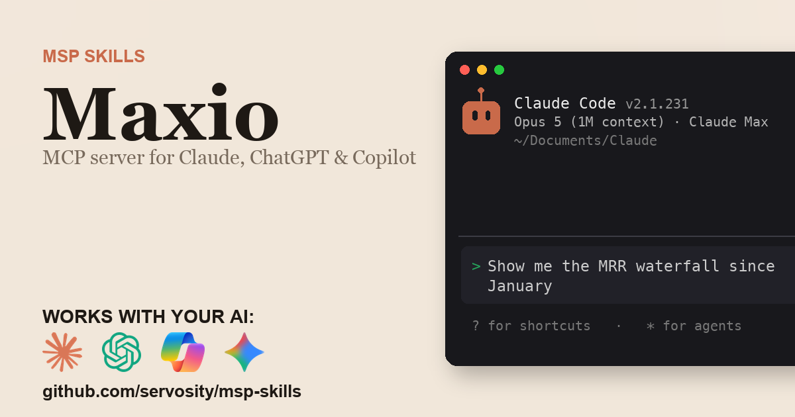

# Maxio + AI - for ChatGPT, Claude, GitHub Copilot, Microsoft 365 Copilot, Gemini, and any agent that speaks MCP

> Unofficial. Community-built Claude Code Skill and MCP server for the Maxio
> API. Not affiliated with, endorsed by, or sponsored by Maxio LLC.

<!-- media:start -->
<p align="center">
  <a href="https://msp-skills.compoundingteams.com/skills/maxio/">
    
  </a>
</p>
<p align="center"><sub><a href="https://msp-skills.compoundingteams.com/skills/maxio/">Full skill page</a> - install, outcomes, safety model.</sub></p>
<!-- media:end -->

Open, local revenue-intelligence CLI for Maxio Advanced Billing  -  MRR waterfalls, retention, and per-client history computed offline from a SQLite mirror, so the trended history survives even though the live API returns only point-in-time figures. Works with the AI you already use - **ChatGPT** (Plus/Pro+), **Claude Desktop**, **Codex**, **Claude Code**, **Claude Cowork**, and **GitHub Copilot** - plus **Microsoft 365 Copilot / Copilot Studio** and **Google Gemini** via the remote path. Free, open source, runs on your laptop. Built for MSP owners. No code required.

## Works with your agent

The six agents MSP owners actually use (self-serve, works today):

| Your AI agent | How to install the Maxio skill |
| --- | --- |
| **Claude Desktop** | Run installer, then **Settings > Extensions** to register `maxio-mcp` (no JSON editing). |
| **ChatGPT** (paid plans) | Run installer, expose `maxio-mcp` over HTTPS, register as a Developer Mode connector. |
| **Codex CLI** | Paste the install prompt below. |
| **Claude Code** | Paste the install prompt below. |
| **Claude Cowork** | Paste the install prompt below. |
| **GitHub Copilot** (VS Code) | Run installer, add `maxio-mcp` to `mcp.json` under the `servers` key, then pick **Agent** mode. |

For ChatGPT, the Maxio MCP server is stdio - to use it with ChatGPT you expose it over HTTPS via the `mcp-remote` bridge or your own endpoint. See [mcp-install.md](./mcp-install.md).

### Also for the Microsoft and Google stacks

Big install base, but an honest heads-up: these are the **remote / enterprise** path, not the local binary you just installed.

| Agent | What it takes |
| --- | --- |
| **Microsoft 365 Copilot / Copilot Studio** | **Not self-serve.** Host `maxio-mcp` over HTTPS, then wire it into Copilot Studio (**Tools > Add a tool > Model Context Protocol > Server URL**) or a declarative agent. Needs a Copilot Studio license + tenant admin. See [mcp-install.md](./mcp-install.md). |
| **Google Gemini** | **Gemini CLI** is local - same as Claude Code. The **Gemini app** is remote - same HTTPS path as ChatGPT. See [mcp-install.md](./mcp-install.md). |

> **Skill-native agents (also covered):** [Hermes](https://hermes-agent.nousresearch.com) and [OpenClaw](#install-for-openclaw) read this skill's `SKILL.md` directly *and* speak MCP - see their install sections below. Also works with Cursor, Windsurf, Cline, Continue.dev, and Zed via MCP. Full per-tool wire-up: **[docs/which-agent.md](../../docs/which-agent.md)**.

> **Run more than one agent?** Install across all 51+ supported agents in one command: `npx skills add Servosity/msp-skills@latest` (requires Node.js, then run the per-skill installer for the CLI/MCP binaries). See [docs/which-agent.md](../../docs/which-agent.md#install-across-all-your-agents-at-once).

## Install in 60 seconds

### Fastest for Claude Desktop - one-click `.mcpb`

[**Download Maxio MCP (.mcpb)**](https://github.com/servosity/msp-skills/releases/download/maxio-v0.1.2/maxio-mcp.mcpb) - then open **Claude Desktop > Settings > Extensions** and select the file. One click, no JSON, no shell. (Browse every Maxio release on the [releases page](https://github.com/servosity/msp-skills/releases?q=maxio).)

Prefer the Claude Code plugin? Add the marketplace once, then install - works immediately, no directory listing required:

```
/plugin marketplace add Servosity/msp-skills
/plugin install maxio@msp-skills
```

### Path A - paste one prompt into your AI agent (recommended)

Copy this into **Claude Code**, **Codex CLI**, or **Claude Cowork**:

> Install the Maxio Skill and MCP server from Servosity/msp-skills in this agent workspace. If this workspace uses a POSIX shell (macOS, Linux, WSL, or Bash), run `bash <(curl -fsSL https://raw.githubusercontent.com/Servosity/msp-skills/main/skills/maxio/install.sh)`. If it uses Windows PowerShell, run `iwr -useb https://raw.githubusercontent.com/Servosity/msp-skills/main/skills/maxio/install.ps1 | iex`. Then authenticate per the README and run `maxio-cli --help` to explore.

The same prompt works in any agent that can run shell.

### Path B - run the installer yourself

**Windows (PowerShell):**

```powershell
iwr -useb https://raw.githubusercontent.com/Servosity/msp-skills/main/skills/maxio/install.ps1 | iex
```

**macOS / Linux:**

```bash
bash <(curl -fsSL https://raw.githubusercontent.com/Servosity/msp-skills/main/skills/maxio/install.sh)
```

The installer drops both `maxio-cli` (the CLI) and `maxio-mcp` (the MCP server) into your user bin path. Claude Code, Codex, and Cowork discover the Skill via `SKILL.md` in this directory.

Verify:

```bash
maxio-cli --version
```

### Upgrade to the latest version

The installer always fetches the current release - re-run it to upgrade:

**macOS / Linux:**

```bash
bash <(curl -fsSL https://raw.githubusercontent.com/Servosity/msp-skills/main/skills/maxio/install.sh)
```

**Windows (PowerShell):**

```powershell
iwr -useb https://raw.githubusercontent.com/Servosity/msp-skills/main/skills/maxio/install.ps1 | iex
```

Claude Desktop `.mcpb` users: download the latest `.mcpb` (top of this section) and re-select it in **Settings > Extensions**. Claude Code plugin users: `/plugin update maxio@msp-skills`.

### Add to Claude Desktop, GitHub Copilot, Gemini CLI, Microsoft 365 Copilot, or another MCP client

After the installer runs, see **[mcp-install.md](./mcp-install.md)** and **[docs/which-agent.md](../../docs/which-agent.md)** for the per-agent wire-up - one section per agent, including the GitHub Copilot `servers` key and the remote Microsoft 365 Copilot / Copilot Studio path. Claude Desktop's Settings > Extensions panel is the simplest path; the MCP config block (for users who prefer editing JSON) is documented in mcp-install.md.

<!-- pp-hermes-install-anchor -->
### Install for Hermes

From the Hermes CLI:

```bash
hermes skills install servosity/msp-skills/skills/maxio --force
```

Inside a Hermes chat session:

```
/skills install servosity/msp-skills/skills/maxio --force
```

Hermes [speaks MCP natively](https://hermes-agent.nousresearch.com), so it can also use the `maxio-mcp` server directly - same install path, same env vars.

### Install for OpenClaw

Tell your OpenClaw agent (copy this):

> Install the maxio skill from https://github.com/servosity/msp-skills/tree/main/skills/maxio. The skill defines how its required CLI (`maxio-cli`) can be installed via the `openclaw:` frontmatter block.

OpenClaw isn't generally available yet; the frontmatter wiring is pre-shipped and will activate the moment OpenClaw launches.

### Authenticate

Set the credentials the CLI needs (from your Maxio portal):

```bash
MAXIO_PASSWORD=<value> MAXIO_SITE=<value> MAXIO_USERNAME=<value> maxio-cli doctor
```

`doctor` confirms the credentials work before you run anything that touches data.


## What this skill does

| Question your MSP keeps asking | Command |
| --- | --- |
| What's our MRR and ARR right now? | `maxio-cli mrr now` |
| How did MRR move month over month (new, expansion, contraction, churn, reactivation)? | `maxio-cli mrr waterfall --since 2026-01-01 --group-by month` |
| What's our net and gross revenue retention, and quick ratio? | `maxio-cli retention --since 2026-01-01 --group-by month` |
| What's recurring revenue for this customer, and how has it trended? | `maxio-cli mrr client --customer "Acme"` |
| Which accounts need attention this week? | `maxio-cli triage --limit 20` |
| How much MRR is up for renewal in the next 30 days? | `maxio-cli renewals --within 30` |
| Which usage components drove expansion versus contraction? | `maxio-cli usage-drivers --since 2026-01-01` |
| How many new logos did we land this quarter, and how much MRR? | `maxio-cli new-customers --since 3m` |

Full command reference: [guide.md](./guide.md). For the AI-agent operating contract (`--agent`, `--dry-run`, when to confirm before mutating), see [AGENTS.md](./AGENTS.md).

## What makes this different

Most Maxio integrations and MCP servers proxy each question into a live API call. That's fine for one record. It dies at scale, when you're asking for the MRR movement waterfall and net revenue retention across your entire customer book at board-prep time - because the live API returns only point-in-time figures (and the MRR endpoints require Maxio's Insights/Analytics add-on), with no trended multi-period history to query.

This skill syncs Maxio into a **local SQLite mirror** with full-text search, and snapshots each sync into a time series. Aggregate questions become one local computation: instant, offline, and the AI sees the answer, not the raw data. Compound commands like `maxio-cli mrr waterfall`, `maxio-cli retention`, and `maxio-cli reconcile` join across subscriptions, customers, components, and invoices - work a stateless API wrapper can't do, and the history keeps growing because the live API has no endpoint that reconstructs historic MRR movement or retention after the fact.

## The pain this closes

On Maxio's own [G2 reviews](https://www.g2.com/products/maxio-formerly-saasoptics-and-chargify/reviews), operators name recurring-revenue reporting as the weak spot: MRR, churn, and ARPA are hard to get out cleanly, and teams report having to use third-party applications on imported billing data to answer them. Even a basic ask - the customers who signed up in a given window and the revenue they brought - has no clean portal answer, and the live API returns only point-in-time figures, with no endpoint to reconstruct the historic trend.

This skill closes that gap from the terminal or your AI agent:

- `maxio-cli mrr waterfall --since 2026-01-01 --group-by month` - the New/Expansion/Contraction/Churn/Reactivation movement, monthly.
- `maxio-cli retention --since 2026-01-01 --group-by month` - net and gross revenue retention, plus quick ratio.
- `maxio-cli new-customers --since 3m` - new logos in the window and the MRR they brought.
- `maxio-cli triage --limit 20` - the accounts that need attention right now.
- `maxio-cli reconcile --since 2026-01-01` - where normalized MRR diverges from what was actually invoiced.

See [pain-point.md](./pain-point.md) for the longer narrative.

## Frequently asked questions

### Does this work with ChatGPT?

Yes, on **Plus, Pro, Team, Business, Enterprise, and Education** plans (Free tier does not yet expose Developer Mode). ChatGPT connects to **remote** MCP servers over HTTPS, not local stdio binaries. The Maxio MCP server is local, so for ChatGPT you expose it via the `mcp-remote` bridge or your own HTTPS endpoint. Step-by-step in [mcp-install.md](./mcp-install.md).

### Does this work with Codex, Cursor, Windsurf, Cline, Copilot, or Gemini?

Yes - all of them speak MCP. Cross-tool install commands are in the matrix above and the deep-dive in [docs/which-agent.md](../../docs/which-agent.md).

### Do I need to know how to code?

No. The recommended install is to paste one sentence into Claude Code or Codex - your agent reads `SKILL.md` and does the install. The fallback is a one-line installer per OS (bash or PowerShell). Neither path requires writing code. You'll enter your Maxio credentials once.

### Is my Maxio data safe?

Your data stays on **your machine**. The CLI and MCP server are local binaries. The SQLite mirror sits in a directory under your user account. The AI agent only sees what the CLI returns - typically a query result, not raw bulk data. Credentials are read from your environment or your agent's config; never bundled into this repo or transmitted anywhere by MSP Skills.

### Will this hit my Maxio API rate limits?

Rarely, for the analytics. After you sync, the revenue-analytics commands (`maxio-cli mrr waterfall`, `maxio-cli retention`, `maxio-cli cohort`, `maxio-cli triage`, `maxio-cli reconcile`) read from the local SQLite mirror, so they make zero API calls. Keeping the mirror current is two incremental commands - `maxio-cli sync` for the full dataset and `maxio-cli mrr sync` to snapshot MRR-movement history - and both fetch only what changed since the last run. The endpoint-mirror commands and `maxio-cli tail` read live from Maxio, so those do count against your limits.

### Do I need to be a Maxio partner or customer?

You need your own Maxio Advanced Billing API credentials (a username and password) - that's it. This is an unofficial, community-built skill, not a Maxio product, so there is no partner program or separate signup. It reads only the data your credentials already grant.

### Will this replace my Maxio portal?

No. It complements the portal, which still owns billing operations and configuration. This skill gives your AI agent fast, trended revenue answers and keeps a local copy of the history that the live API can no longer reconstruct.

### What does it cost?

Free. Apache-2.0 licensed. You pay only for whichever AI agent you use (Claude, ChatGPT, Codex, etc.), and that's billed by your AI provider, not by us.

## Safety model

| Tier | Examples | Recommended agent policy |
| --- | --- | --- |
| Read | `maxio-cli mrr now`, `maxio-cli retention`, `maxio-cli triage`, `maxio-cli search` | Allow |
| Write (routine) | `maxio-cli customers update`, `maxio-cli subscriptions-json create-subscription` | Preview with `--dry-run`, then a reviewed write |
| Destructive / config | `maxio-cli customers delete`, `maxio-cli subscription-groups delete`, `maxio-cli payment-profiles delete-unused` | Human-in-the-loop only |

The strongest control is the **scope you grant the Maxio credentials** - the CLI can only do what the credentials are permitted to do. Full details, including how to lock it down, are in [governance.md](./governance.md).

## Status

Beta. Validated against the Maxio API surface and being validated with MSPs running it live against their own production tenant in our weekly Build Sessions. RSVP at [compoundingteams.com/build-sessions](https://compoundingteams.com/build-sessions).

---

**Standards.** Conforms to the open [Agent Skills spec](https://agentskills.io) (Anthropic, Dec 2025; 40+ agents). MCP-compatible - works with any MCP-capable agent including [Hermes](https://hermes-agent.nousresearch.com). OpenClaw-ready (frontmatter pre-wired, awaiting OpenClaw launch).

Maintained by [Servosity](https://www.servosity.com). Apache-2.0 licensed. Built with [CLI Printing Press](https://github.com/mvanhorn/cli-printing-press). _Last updated: 2026-06-30._
