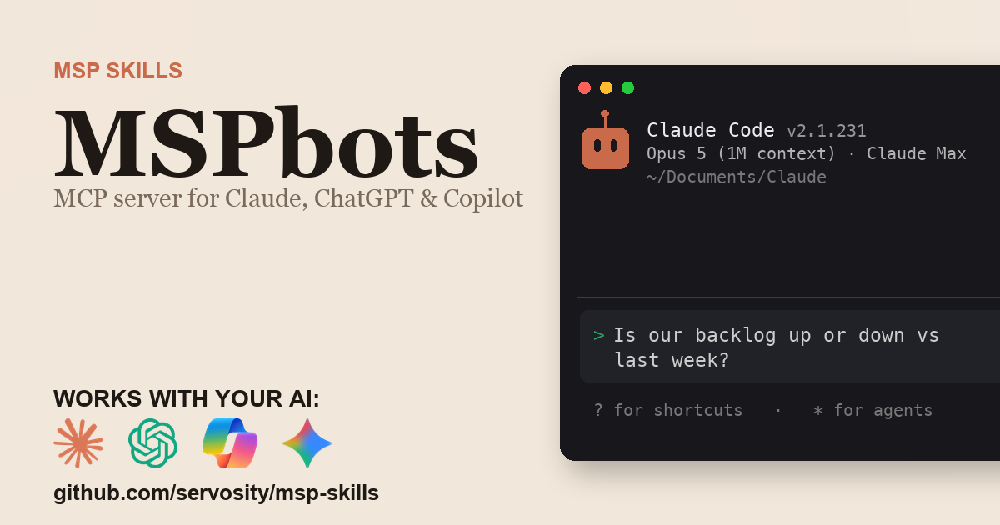

# MSPbots + AI - for ChatGPT, Claude, GitHub Copilot, Microsoft 365 Copilot, Gemini, and any agent that speaks MCP

> Unofficial. Community-built Claude Code Skill and MCP server for the MSPbots
> API. Not affiliated with, endorsed by, or sponsored by MSPbots, Inc..

<!-- media:start -->
<p align="center">
  <a href="https://msp-skills.compoundingteams.com/skills/mspbots/">
    
  </a>
</p>
<p align="center"><sub><a href="https://msp-skills.compoundingteams.com/skills/mspbots/">Full skill page</a> - install, outcomes, safety model.</sub></p>
<!-- media:end -->

The first MSPbots tool anywhere  -  readable filters, alias-named resources, full exports, and the KPI history MSPbots itself doesn't keep. Works with the AI you already use - **ChatGPT** (Plus/Pro+), **Claude Desktop**, **Codex**, **Claude Code**, **Claude Cowork**, and **GitHub Copilot** - plus **Microsoft 365 Copilot / Copilot Studio** and **Google Gemini** via the remote path. Free, open source, runs on your laptop. Built for MSP owners. No code required.

## Works with your agent

The six agents MSP owners actually use (self-serve, works today):

| Your AI agent | How to install the MSPbots skill |
| --- | --- |
| **Claude Desktop** | Run installer, then **Settings > Extensions** to register `mspbots-mcp` (no JSON editing). |
| **ChatGPT** (paid plans) | Run installer, expose `mspbots-mcp` over HTTPS, register as a Developer Mode connector. |
| **Codex CLI** | Paste the install prompt below. |
| **Claude Code** | Paste the install prompt below. |
| **Claude Cowork** | Paste the install prompt below. |
| **GitHub Copilot** (VS Code) | Run installer, add `mspbots-mcp` to `mcp.json` under the `servers` key, then pick **Agent** mode. |

For ChatGPT, the MSPbots MCP server is stdio - to use it with ChatGPT you expose it over HTTPS via the `mcp-remote` bridge or your own endpoint. See [mcp-install.md](./mcp-install.md).

### Also for the Microsoft and Google stacks

Big install base, but an honest heads-up: these are the **remote / enterprise** path, not the local binary you just installed.

| Agent | What it takes |
| --- | --- |
| **Microsoft 365 Copilot / Copilot Studio** | **Not self-serve.** Host `mspbots-mcp` over HTTPS, then wire it into Copilot Studio (**Tools > Add a tool > Model Context Protocol > Server URL**) or a declarative agent. Needs a Copilot Studio license + tenant admin. See [mcp-install.md](./mcp-install.md). |
| **Google Gemini** | **Gemini CLI** is local - same as Claude Code. The **Gemini app** is remote - same HTTPS path as ChatGPT. See [mcp-install.md](./mcp-install.md). |

> **Skill-native agents (also covered):** [Hermes](https://hermes-agent.nousresearch.com) and [OpenClaw](#install-for-openclaw) read this skill's `SKILL.md` directly *and* speak MCP - see their install sections below. Also works with Cursor, Windsurf, Cline, Continue.dev, and Zed via MCP. Full per-tool wire-up: **[docs/which-agent.md](../../docs/which-agent.md)**.

> **Run more than one agent?** Install across all 51+ supported agents in one command: `npx skills add Servosity/msp-skills@latest` (requires Node.js, then run the per-skill installer for the CLI/MCP binaries). See [docs/which-agent.md](../../docs/which-agent.md#install-across-all-your-agents-at-once).

## Install in 60 seconds

### Fastest for Claude Desktop - one-click `.mcpb`

[**Download MSPbots MCP (.mcpb)**](https://github.com/servosity/msp-skills/releases/download/mspbots-v4.22.0/mspbots-mcp.mcpb) - then open **Claude Desktop > Settings > Extensions** and select the file. One click, no JSON, no shell. (Browse every MSPbots release on the [releases page](https://github.com/servosity/msp-skills/releases?q=mspbots).)

Prefer the Claude Code plugin? Add the marketplace once, then install - works immediately, no directory listing required:

```
/plugin marketplace add Servosity/msp-skills
/plugin install mspbots@msp-skills
```

### Path A - paste one prompt into your AI agent (recommended)

Copy this into **Claude Code**, **Codex CLI**, or **Claude Cowork**:

> Install the MSPbots Skill and MCP server from Servosity/msp-skills in this agent workspace. If this workspace uses a POSIX shell (macOS, Linux, WSL, or Bash), run `bash <(curl -fsSL https://raw.githubusercontent.com/Servosity/msp-skills/main/skills/mspbots/install.sh)`. If it uses Windows PowerShell, run `iwr -useb https://raw.githubusercontent.com/Servosity/msp-skills/main/skills/mspbots/install.ps1 | iex`. Then authenticate per the README and run `mspbots-cli --help` to explore.

The same prompt works in any agent that can run shell.

### Path B - run the installer yourself

**Windows (PowerShell):**

```powershell
iwr -useb https://raw.githubusercontent.com/Servosity/msp-skills/main/skills/mspbots/install.ps1 | iex
```

**macOS / Linux:**

```bash
bash <(curl -fsSL https://raw.githubusercontent.com/Servosity/msp-skills/main/skills/mspbots/install.sh)
```

The installer drops both `mspbots-cli` (the CLI) and `mspbots-mcp` (the MCP server) into your user bin path. Claude Code, Codex, and Cowork discover the Skill via `SKILL.md` in this directory.

Verify:

```bash
mspbots-cli --version
```

### Upgrade to the latest version

The installer always fetches the current release - re-run it to upgrade:

**macOS / Linux:**

```bash
bash <(curl -fsSL https://raw.githubusercontent.com/Servosity/msp-skills/main/skills/mspbots/install.sh)
```

**Windows (PowerShell):**

```powershell
iwr -useb https://raw.githubusercontent.com/Servosity/msp-skills/main/skills/mspbots/install.ps1 | iex
```

Claude Desktop `.mcpb` users: download the latest `.mcpb` (top of this section) and re-select it in **Settings > Extensions**. Claude Code plugin users: `/plugin update mspbots@msp-skills`.

### Add to Claude Desktop, GitHub Copilot, Gemini CLI, Microsoft 365 Copilot, or another MCP client

After the installer runs, see **[mcp-install.md](./mcp-install.md)** and **[docs/which-agent.md](../../docs/which-agent.md)** for the per-agent wire-up - one section per agent, including the GitHub Copilot `servers` key and the remote Microsoft 365 Copilot / Copilot Studio path. Claude Desktop's Settings > Extensions panel is the simplest path; the MCP config block (for users who prefer editing JSON) is documented in mcp-install.md.

<!-- pp-hermes-install-anchor -->
### Install for Hermes

From the Hermes CLI:

```bash
hermes skills install servosity/msp-skills/skills/mspbots --force
```

Inside a Hermes chat session:

```
/skills install servosity/msp-skills/skills/mspbots --force
```

Hermes [speaks MCP natively](https://hermes-agent.nousresearch.com), so it can also use the `mspbots-mcp` server directly - same install path, same env vars.

### Install for OpenClaw

Tell your OpenClaw agent (copy this):

> Install the mspbots skill from https://github.com/servosity/msp-skills/tree/main/skills/mspbots. The skill defines how its required CLI (`mspbots-cli`) can be installed via the `openclaw:` frontmatter block.

OpenClaw isn't generally available yet; the frontmatter wiring is pre-shipped and will activate the moment OpenClaw launches.

### Authenticate

Set the credentials the CLI needs (from your MSPbots portal):

```bash
MSPBOTS_API_KEY=<value> mspbots-cli doctor
```

`doctor` confirms the credentials work before you run anything that touches data.


## What this skill does

<!-- TODO: outcome-first table mapping the 5-8 questions an MSP would ask to the single command that answers each. Source-of-truth is SKILL.md "Unique Capabilities" / "Command Reference" - extract the highest-leverage ones. Format:

| Question your MSP keeps asking | Command |
| --- | --- |
| ... | `mspbots-cli ...` |

-->

Full command reference: [guide.md](./guide.md). For the AI-agent operating contract (`--agent`, `--dry-run`, when to confirm before mutating), see [AGENTS.md](./AGENTS.md).

## What makes this different

Most MSPbots integrations and MCP servers proxy each question into a live API call. That's fine for one record. It dies at scale, when you're asking <!-- TODO: vendor-specific QBR-time example: e.g. "how many backup-failure tickets across all 47 clients last quarter" -->.

This skill syncs MSPbots into a **local SQLite mirror** with full-text search. Aggregate questions become one local SQL join: instant, offline, and the AI sees the answer, not the raw data. Compound commands like <!-- TODO: 2-3 highest-leverage compound commands from this skill --> join across <!-- TODO: which entities --> - work a stateless API wrapper can't do.

## The pain this closes

<!-- TODO: fold pain-point.md content here. Cite a concrete community source (r/msp, MSPGeek, vendor survey). State the pain in MSP-owner vocabulary. Then list 3-5 of this skill's highest-leverage commands mapped to the pain. -->

See [pain-point.md](./pain-point.md) for the longer narrative.

## Frequently asked questions

### Does this work with ChatGPT?

Yes, on **Plus, Pro, Team, Business, Enterprise, and Education** plans (Free tier does not yet expose Developer Mode). ChatGPT connects to **remote** MCP servers over HTTPS, not local stdio binaries. The MSPbots MCP server is local, so for ChatGPT you expose it via the `mcp-remote` bridge or your own HTTPS endpoint. Step-by-step in [mcp-install.md](./mcp-install.md).

### Does this work with Codex, Cursor, Windsurf, Cline, Copilot, or Gemini?

Yes - all of them speak MCP. Cross-tool install commands are in the matrix above and the deep-dive in [docs/which-agent.md](../../docs/which-agent.md).

### Do I need to know how to code?

No. The recommended install is to paste one sentence into Claude Code or Codex - your agent reads `SKILL.md` and does the install. The fallback is a one-line installer per OS (bash or PowerShell). Neither path requires writing code. You'll enter your MSPbots credentials once.

### Is my MSPbots data safe?

Your data stays on **your machine**. The CLI and MCP server are local binaries. The SQLite mirror sits in a directory under your user account. The AI agent only sees what the CLI returns - typically a query result, not raw bulk data. Credentials are read from your environment or your agent's config; never bundled into this repo or transmitted anywhere by MSP Skills.

<!-- TODO: 2-4 vendor-specific FAQ entries - answer real searches MSP owners type. Examples:
- "How is this different from <vendor>'s built-in AI integration?" (if the vendor has one)
- "Will this hit my <vendor> API rate limits?"
- "Do I need to be a <vendor> partner/customer?"
- "Will this replace my <vendor> portal/UI?"
-->

### What does it cost?

Free. Apache-2.0 licensed. You pay only for whichever AI agent you use (Claude, ChatGPT, Codex, etc.), and that's billed by your AI provider, not by us.

## Safety model

<!-- TODO: tier table (Read / Write-routine / Destructive / etc.) from governance.md. Format:

| Tier | Examples | Recommended agent policy |
| --- | --- | --- |
| Read | ... | Allow |
| Write (routine) | ... | Preview with `--dry-run`, then a reviewed write |
| Destructive / config | ... | Human-in-the-loop only |

-->

The strongest control is the **scope you grant the MSPbots credentials** - the CLI can only do what the credentials are permitted to do. Full details, including how to lock it down, are in [governance.md](./governance.md).

## Status

Beta. Validated against the MSPbots API surface and being validated with MSPs running it live against their own production tenant in our weekly Build Sessions. RSVP at [compoundingteams.com/build-sessions](https://compoundingteams.com/build-sessions).

---

**Standards.** Conforms to the open [Agent Skills spec](https://agentskills.io) (Anthropic, Dec 2025; 40+ agents). MCP-compatible - works with any MCP-capable agent including [Hermes](https://hermes-agent.nousresearch.com). OpenClaw-ready (frontmatter pre-wired, awaiting OpenClaw launch).

Maintained by [Servosity](https://www.servosity.com). Apache-2.0 licensed. Built with [CLI Printing Press](https://github.com/mvanhorn/cli-printing-press). _Last updated: <!-- TODO: YYYY-MM-DD -->._
