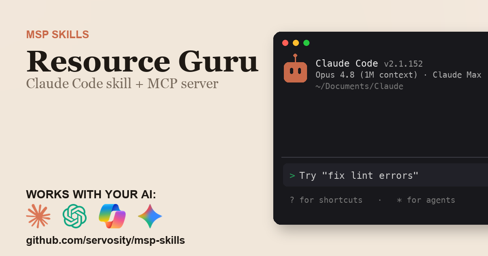

# Resource Guru + AI - for ChatGPT, Claude, GitHub Copilot, Microsoft 365 Copilot, Gemini, and any agent that speaks MCP

> Unofficial. Community-built Claude Code Skill and MCP server for the Resource Guru
> API. Not affiliated with, endorsed by, or sponsored by Resource Guru Limited.

<!-- media:start -->
<p align="center">
  <a href="https://msp-skills.compoundingteams.com/skills/resourceguru/">
    
  </a>
</p>
<p align="center"><sub><a href="https://msp-skills.compoundingteams.com/skills/resourceguru/">Full skill page</a> - install, outcomes, safety model.</sub></p>
<!-- media:end -->

Operate Resource Guru from your AI agent. Works with the AI you already use - **ChatGPT** (Plus/Pro+), **Claude Desktop**, **Codex**, **Claude Code**, **Claude Cowork**, and **GitHub Copilot** - plus **Microsoft 365 Copilot / Copilot Studio** and **Google Gemini** via the remote path. Free, open source, runs on your laptop. Built for MSP owners. No code required.

## Works with your agent

The six agents MSP owners actually use (self-serve, works today):

| Your AI agent | How to install the Resource Guru skill |
| --- | --- |
| **Claude Desktop** | Run installer, then **Settings > Extensions** to register `resourceguru-mcp` (no JSON editing). |
| **ChatGPT** (paid plans) | Run installer, expose `resourceguru-mcp` over HTTPS, register as a Developer Mode connector. |
| **Codex CLI** | Paste the install prompt below. |
| **Claude Code** | Paste the install prompt below. |
| **Claude Cowork** | Paste the install prompt below. |
| **GitHub Copilot** (VS Code) | Run installer, add `resourceguru-mcp` to `mcp.json` under the `servers` key, then pick **Agent** mode. |

For ChatGPT, the Resource Guru MCP server is stdio - to use it with ChatGPT you expose it over HTTPS via the `mcp-remote` bridge or your own endpoint. See [mcp-install.md](./mcp-install.md).

### Also for the Microsoft and Google stacks

Big install base, but an honest heads-up: these are the **remote / enterprise** path, not the local binary you just installed.

| Agent | What it takes |
| --- | --- |
| **Microsoft 365 Copilot / Copilot Studio** | **Not self-serve.** Host `resourceguru-mcp` over HTTPS, then wire it into Copilot Studio (**Tools > Add a tool > Model Context Protocol > Server URL**) or a declarative agent. Needs a Copilot Studio license + tenant admin. See [mcp-install.md](./mcp-install.md). |
| **Google Gemini** | **Gemini CLI** is local - same as Claude Code. The **Gemini app** is remote - same HTTPS path as ChatGPT. See [mcp-install.md](./mcp-install.md). |

> **Skill-native agents (also covered):** [Hermes](https://hermes-agent.nousresearch.com) and [OpenClaw](#install-for-openclaw) read this skill's `SKILL.md` directly *and* speak MCP - see their install sections below. Also works with Cursor, Windsurf, Cline, Continue.dev, and Zed via MCP. Full per-tool wire-up: **[docs/which-agent.md](../../docs/which-agent.md)**.

> **Run more than one agent?** Install across all 51+ supported agents in one command: `npx skills add Servosity/msp-skills@latest` (requires Node.js, then run the per-skill installer for the CLI/MCP binaries). See [docs/which-agent.md](../../docs/which-agent.md#install-across-all-your-agents-at-once).

## Install in 60 seconds

### Fastest for Claude Desktop - one-click `.mcpb`

[**Download Resource Guru MCP (.mcpb)**](https://github.com/servosity/msp-skills/releases/download/resourceguru-v0.1.1/resourceguru-mcp.mcpb) - then open **Claude Desktop > Settings > Extensions** and select the file. One click, no JSON, no shell. (Browse every Resource Guru release on the [releases page](https://github.com/servosity/msp-skills/releases?q=resourceguru).)

Prefer the Claude Code plugin? Add the marketplace once, then install - works immediately, no directory listing required:

```
/plugin marketplace add Servosity/msp-skills
/plugin install resourceguru@msp-skills
```

### Path A - paste one prompt into your AI agent (recommended)

Copy this into **Claude Code**, **Codex CLI**, or **Claude Cowork**:

> Install the Resource Guru Skill and MCP server from Servosity/msp-skills in this agent workspace. If this workspace uses a POSIX shell (macOS, Linux, WSL, or Bash), run `bash <(curl -fsSL https://raw.githubusercontent.com/Servosity/msp-skills/main/skills/resourceguru/install.sh)`. If it uses Windows PowerShell, run `iwr -useb https://raw.githubusercontent.com/Servosity/msp-skills/main/skills/resourceguru/install.ps1 | iex`. Then authenticate per the README and run `resourceguru-cli --help` to explore.

The same prompt works in any agent that can run shell.

### Path B - run the installer yourself

**Windows (PowerShell):**

```powershell
iwr -useb https://raw.githubusercontent.com/Servosity/msp-skills/main/skills/resourceguru/install.ps1 | iex
```

**macOS / Linux:**

```bash
bash <(curl -fsSL https://raw.githubusercontent.com/Servosity/msp-skills/main/skills/resourceguru/install.sh)
```

The installer drops both `resourceguru-cli` (the CLI) and `resourceguru-mcp` (the MCP server) into your user bin path. Claude Code, Codex, and Cowork discover the Skill via `SKILL.md` in this directory.

Verify:

```bash
resourceguru-cli --version
```

### Upgrade to the latest version

The installer always fetches the current release - re-run it to upgrade:

**macOS / Linux:**

```bash
bash <(curl -fsSL https://raw.githubusercontent.com/Servosity/msp-skills/main/skills/resourceguru/install.sh)
```

**Windows (PowerShell):**

```powershell
iwr -useb https://raw.githubusercontent.com/Servosity/msp-skills/main/skills/resourceguru/install.ps1 | iex
```

Claude Desktop `.mcpb` users: download the latest `.mcpb` (top of this section) and re-select it in **Settings > Extensions**. Claude Code plugin users: `/plugin update resourceguru@msp-skills`.

### Add to Claude Desktop, GitHub Copilot, Gemini CLI, Microsoft 365 Copilot, or another MCP client

After the installer runs, see **[mcp-install.md](./mcp-install.md)** and **[docs/which-agent.md](../../docs/which-agent.md)** for the per-agent wire-up - one section per agent, including the GitHub Copilot `servers` key and the remote Microsoft 365 Copilot / Copilot Studio path. Claude Desktop's Settings > Extensions panel is the simplest path; the MCP config block (for users who prefer editing JSON) is documented in mcp-install.md.

<!-- pp-hermes-install-anchor -->
### Install for Hermes

From the Hermes CLI:

```bash
hermes skills install servosity/msp-skills/skills/resourceguru --force
```

Inside a Hermes chat session:

```
/skills install servosity/msp-skills/skills/resourceguru --force
```

Hermes [speaks MCP natively](https://hermes-agent.nousresearch.com), so it can also use the `resourceguru-mcp` server directly - same install path, same env vars.

### Install for OpenClaw

Tell your OpenClaw agent (copy this):

> Install the resourceguru skill from https://github.com/servosity/msp-skills/tree/main/skills/resourceguru. The skill defines how its required CLI (`resourceguru-cli`) can be installed via the `openclaw:` frontmatter block.

OpenClaw isn't generally available yet; the frontmatter wiring is pre-shipped and will activate the moment OpenClaw launches.

### Authenticate

Resource Guru uses HTTP Basic auth - your account email and password:

```bash
RESOURCEGURU_EMAIL=<value> RESOURCEGURU_PASSWORD=<value> resourceguru-cli doctor
```

`doctor` confirms the credentials work before you run anything that touches data. Full per-agent wiring is in [mcp-install.md](./mcp-install.md).


## What this skill does

| Question your team keeps asking | Command |
| --- | --- |
| Who is overbooked across the whole fleet this month? | `resourceguru-cli overbooked --start 2026-06-01 --end 2026-06-30 --agent` |
| What is each person's utilization, day by day? | `resourceguru-cli utilization --start 2026-06-01 --end 2026-06-30 --heatmap --agent` |
| Who has slack to take on new work next week? | `resourceguru-cli bench --start 2026-06-08 --end 2026-06-14 --threshold 50 --agent` |
| How much bookable capacity is left next month? | `resourceguru-cli capacity --start 2026-07-01 --end 2026-07-31 --agent` |
| What changed on the schedule in the last week? | `resourceguru-cli since 7d --agent` |
| How is workload distributed across the team? | `resourceguru-cli load --json` |
| Find a booking, client, or project anywhere in the schedule | `resourceguru-cli search "website redesign"` |

Run `resourceguru-cli sync` once to populate the local mirror; the analytics commands above then read it offline.

Full command reference: [guide.md](./guide.md). For the AI-agent operating contract (`--agent`, `--dry-run`, when to confirm before mutating), see [AGENTS.md](./AGENTS.md).

## What makes this different

Most Resource Guru integrations and MCP servers proxy each question into a live API call. That's fine for one record. It dies at scale, when you're asking "what was every resource's booked-vs-available utilization, for every day this quarter."

This skill syncs Resource Guru into a **local SQLite mirror** with full-text search. Aggregate questions become one local computation: instant, offline, and the AI sees the answer, not the raw data. Compound commands like `utilization`, `overbooked`, and `capacity` join bookings against each resource's daily availability - per-day math a stateless API wrapper can't do, because the API exposes the per-day booking breakdown but never aggregates it for you.

## The pain this closes

Verified Resource Guru reviewers on [Capterra](https://www.capterra.com/p/134429/Resource-Guru/reviews/) say the reporting and advanced analytics "feel limited" and that they have to "download reports as a pivot" to get the breakdowns they want. The booking-clash warning catches one over-allocation at a time on write, but there is no single fleet-wide view of every overcommitted resource-day across a window - so capacity planning turns into a spreadsheet exercise.

This skill closes that gap from the synced mirror:

- `resourceguru-cli utilization --start <date> --end <date> --heatmap --agent` - booked-vs-available for every resource on every day, not a range average.
- `resourceguru-cli overbooked --start <date> --end <date> --agent` - every resource-day over capacity, across the whole fleet.
- `resourceguru-cli bench --start <date> --end <date> --threshold 50 --agent` - who is under-used and free for new work.
- `resourceguru-cli capacity --start <date> --end <date> --agent` - remaining bookable minutes before you commit a project.
- `resourceguru-cli since 7d --agent` - what moved on the schedule since you last looked.

See [pain-point.md](./pain-point.md) for the longer narrative.

## Frequently asked questions

### Does this work with ChatGPT?

Yes, on **Plus, Pro, Team, Business, Enterprise, and Education** plans (Free tier does not yet expose Developer Mode). ChatGPT connects to **remote** MCP servers over HTTPS, not local stdio binaries. The Resource Guru MCP server is local, so for ChatGPT you expose it via the `mcp-remote` bridge or your own HTTPS endpoint. Step-by-step in [mcp-install.md](./mcp-install.md).

### Does this work with Codex, Cursor, Windsurf, Cline, Copilot, or Gemini?

Yes - all of them speak MCP. Cross-tool install commands are in the matrix above and the deep-dive in [docs/which-agent.md](../../docs/which-agent.md).

### Do I need to know how to code?

No. The recommended install is to paste one sentence into Claude Code or Codex - your agent reads `SKILL.md` and does the install. The fallback is a one-line installer per OS (bash or PowerShell). Neither path requires writing code. You'll enter your Resource Guru credentials once.

### Is my Resource Guru data safe?

Your data stays on **your machine**. The CLI and MCP server are local binaries. The SQLite mirror sits in a directory under your user account. The AI agent only sees what the CLI returns - typically a query result, not raw bulk data. Credentials are read from your environment or your agent's config; never bundled into this repo or transmitted anywhere by MSP Skills.

### Will this hit my Resource Guru API rate limits?

No. After the first `sync`, `utilization`, `overbooked`, `bench`, `capacity`, and `search` all read the local SQLite mirror with zero API calls. You only touch the API when you sync or run a live read, and the CLI honors a configurable `--rate-limit`.

### Do I need to be a Resource Guru admin?

No. You need an account that can read the schedule, authenticated with your account email and password over HTTP Basic. Read-only analytics never need write or admin scope - scope the credential to what you actually use.

### Will this replace the Resource Guru web app?

No. It reports and analyzes; it is not where you edit the schedule. Writes go through the same API the web app uses, so confirm any mutation in Resource Guru afterward. The unique value is the per-day, fleet-wide utilization the portal does not surface.

### What does it cost?

Free. Apache-2.0 licensed. You pay only for whichever AI agent you use (Claude, ChatGPT, Codex, etc.), and that's billed by your AI provider, not by us.

## Safety model

| Tier | Examples | Recommended agent policy |
| --- | --- | --- |
| Read | `utilization`, `overbooked`, `bench`, `capacity`, `since`, `load`, `search`, `accounts list`, any `get` | Allow |
| Write (routine) | `bookings create`, `bookings update`, `clients create`, `projects update`, `activity-types create` | Preview with `--dry-run`, then a reviewed write |
| Destructive / config | `bookings delete`, `clients delete`, `resources delete`, `calendars delete`, `webhooks delete` | Human-in-the-loop only |

The strongest control is the **scope you grant the Resource Guru credentials** - the CLI can only do what the credentials are permitted to do. Full details, including how to lock it down, are in [governance.md](./governance.md).

## Status

Beta. Validated against the Resource Guru API surface and being validated with MSPs running it live against their own production tenant in our weekly Build Sessions. RSVP at [compoundingteams.com/build-sessions](https://compoundingteams.com/build-sessions).

---

**Standards.** Conforms to the open [Agent Skills spec](https://agentskills.io) (Anthropic, Dec 2025; 40+ agents). MCP-compatible - works with any MCP-capable agent including [Hermes](https://hermes-agent.nousresearch.com). OpenClaw-ready (frontmatter pre-wired, awaiting OpenClaw launch).

Maintained by [Servosity](https://www.servosity.com). Apache-2.0 licensed. Built with [CLI Printing Press](https://github.com/mvanhorn/cli-printing-press). _Last updated: 2026-06-30._
