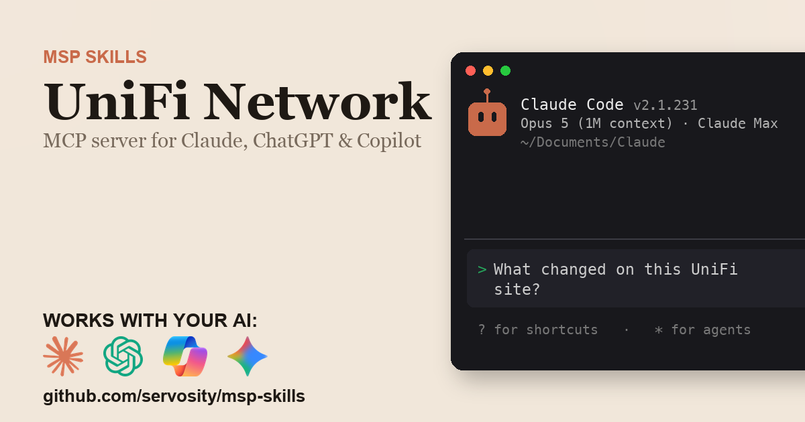

# UniFi + AI - for ChatGPT, Claude, GitHub Copilot, Microsoft 365 Copilot, Gemini, and any agent that speaks MCP

> Unofficial. Community-built Claude Code Skill and MCP server for the UniFi
> API. Not affiliated with, endorsed by, or sponsored by Ubiquiti Inc.

<!-- media:start -->
<p align="center">
  <a href="https://msp-skills.compoundingteams.com/skills/unifi-network/">
    
  </a>
</p>
<p align="center"><sub><a href="https://msp-skills.compoundingteams.com/skills/unifi-network/">Full skill page</a> - install, outcomes, safety model.</sub></p>
<!-- media:end -->

Every UniFi Network API operation, plus drift detection, topology, and rule prediction no other UniFi tool has. Works with the AI you already use - **ChatGPT** (Plus/Pro+), **Claude Desktop**, **Codex**, **Claude Code**, **Claude Cowork**, and **GitHub Copilot** - plus **Microsoft 365 Copilot / Copilot Studio** and **Google Gemini** via the remote path. Free, open source, runs on your laptop. Built for MSP owners. No code required.

## Works with your agent

The six agents MSP owners actually use (self-serve, works today):

| Your AI agent | How to install the UniFi skill |
| --- | --- |
| **Claude Desktop** | Run installer, then **Settings > Extensions** to register `unifi-network-mcp` (no JSON editing). |
| **ChatGPT** (paid plans) | Run installer, expose `unifi-network-mcp` over HTTPS, register as a Developer Mode connector. |
| **Codex CLI** | Paste the install prompt below. |
| **Claude Code** | Paste the install prompt below. |
| **Claude Cowork** | Paste the install prompt below. |
| **GitHub Copilot** (VS Code) | Run installer, add `unifi-network-mcp` to `mcp.json` under the `servers` key, then pick **Agent** mode. |

For ChatGPT, the UniFi MCP server is stdio - to use it with ChatGPT you expose it over HTTPS via the `mcp-remote` bridge or your own endpoint. See [mcp-install.md](./mcp-install.md).

### Also for the Microsoft and Google stacks

Big install base, but an honest heads-up: these are the **remote / enterprise** path, not the local binary you just installed.

| Agent | What it takes |
| --- | --- |
| **Microsoft 365 Copilot / Copilot Studio** | **Not self-serve.** Host `unifi-network-mcp` over HTTPS, then wire it into Copilot Studio (**Tools > Add a tool > Model Context Protocol > Server URL**) or a declarative agent. Needs a Copilot Studio license + tenant admin. See [mcp-install.md](./mcp-install.md). |
| **Google Gemini** | **Gemini CLI** is local - same as Claude Code. The **Gemini app** is remote - same HTTPS path as ChatGPT. See [mcp-install.md](./mcp-install.md). |

> **Skill-native agents (also covered):** [Hermes](https://hermes-agent.nousresearch.com) and [OpenClaw](#install-for-openclaw) read this skill's `SKILL.md` directly *and* speak MCP - see their install sections below. Also works with Cursor, Windsurf, Cline, Continue.dev, and Zed via MCP. Full per-tool wire-up: **[docs/which-agent.md](../../docs/which-agent.md)**.

> **Run more than one agent?** Install across all 51+ supported agents in one command: `npx skills add Servosity/msp-skills@latest` (requires Node.js, then run the per-skill installer for the CLI/MCP binaries). See [docs/which-agent.md](../../docs/which-agent.md#install-across-all-your-agents-at-once).

## Install in 60 seconds

### Fastest for Claude Desktop - one-click `.mcpb`

[**Download UniFi MCP (.mcpb)**](https://github.com/servosity/msp-skills/releases/download/unifi-network-v0.1.1/unifi-network-mcp.mcpb) - then open **Claude Desktop > Settings > Extensions** and select the file. One click, no JSON, no shell. (Browse every UniFi release on the [releases page](https://github.com/servosity/msp-skills/releases?q=unifi-network).)

Prefer the Claude Code plugin? Add the marketplace once, then install - works immediately, no directory listing required:

```
/plugin marketplace add Servosity/msp-skills
/plugin install unifi-network@msp-skills
```

### Path A - paste one prompt into your AI agent (recommended)

Copy this into **Claude Code**, **Codex CLI**, or **Claude Cowork**:

> Install the UniFi Skill and MCP server from Servosity/msp-skills in this agent workspace. If this workspace uses a POSIX shell (macOS, Linux, WSL, or Bash), run `bash <(curl -fsSL https://raw.githubusercontent.com/Servosity/msp-skills/main/skills/unifi-network/install.sh)`. If it uses Windows PowerShell, run `iwr -useb https://raw.githubusercontent.com/Servosity/msp-skills/main/skills/unifi-network/install.ps1 | iex`. Then authenticate per the README and run `unifi-network-cli --help` to explore.

The same prompt works in any agent that can run shell.

### Path B - run the installer yourself

**Windows (PowerShell):**

```powershell
iwr -useb https://raw.githubusercontent.com/Servosity/msp-skills/main/skills/unifi-network/install.ps1 | iex
```

**macOS / Linux:**

```bash
bash <(curl -fsSL https://raw.githubusercontent.com/Servosity/msp-skills/main/skills/unifi-network/install.sh)
```

The installer drops both `unifi-network-cli` (the CLI) and `unifi-network-mcp` (the MCP server) into your user bin path. Claude Code, Codex, and Cowork discover the Skill via `SKILL.md` in this directory.

Verify:

```bash
unifi-network-cli --version
```

### Upgrade to the latest version

The installer always fetches the current release - re-run it to upgrade:

**macOS / Linux:**

```bash
bash <(curl -fsSL https://raw.githubusercontent.com/Servosity/msp-skills/main/skills/unifi-network/install.sh)
```

**Windows (PowerShell):**

```powershell
iwr -useb https://raw.githubusercontent.com/Servosity/msp-skills/main/skills/unifi-network/install.ps1 | iex
```

Claude Desktop `.mcpb` users: download the latest `.mcpb` (top of this section) and re-select it in **Settings > Extensions**. Claude Code plugin users: `/plugin update unifi-network@msp-skills`.

### Add to Claude Desktop, GitHub Copilot, Gemini CLI, Microsoft 365 Copilot, or another MCP client

After the installer runs, see **[mcp-install.md](./mcp-install.md)** and **[docs/which-agent.md](../../docs/which-agent.md)** for the per-agent wire-up - one section per agent, including the GitHub Copilot `servers` key and the remote Microsoft 365 Copilot / Copilot Studio path. Claude Desktop's Settings > Extensions panel is the simplest path; the MCP config block (for users who prefer editing JSON) is documented in mcp-install.md.

<!-- pp-hermes-install-anchor -->
### Install for Hermes

From the Hermes CLI:

```bash
hermes skills install servosity/msp-skills/skills/unifi-network --force
```

Inside a Hermes chat session:

```
/skills install servosity/msp-skills/skills/unifi-network --force
```

Hermes [speaks MCP natively](https://hermes-agent.nousresearch.com), so it can also use the `unifi-network-mcp` server directly - same install path, same env vars.

### Install for OpenClaw

Tell your OpenClaw agent (copy this):

> Install the unifi-network skill from https://github.com/servosity/msp-skills/tree/main/skills/unifi-network. The skill defines how its required CLI (`unifi-network-cli`) can be installed via the `openclaw:` frontmatter block.

OpenClaw isn't generally available yet; the frontmatter wiring is pre-shipped and will activate the moment OpenClaw launches.

### Authenticate

Set the credentials the CLI needs (from your UniFi portal):

```bash
UNIFI_API_KEY=<value> UNIFI_GATEWAY_HOST=<value> unifi-network-cli doctor
```

`doctor` checks config, paths, and gateway reachability, and reports whether credentials are loaded. It does **not** validate them - it reports `present, not verified` and exits 0 even for a wrong key. Run a read command such as `unifi-network-cli sites` to confirm the key actually works.


## What this skill does

| Question your MSP keeps asking | Command |
| --- | --- |
| What changed in this site's config since my last check? | `unifi-network-cli drift --site default --json` |
| What devices and clients joined the network this week? | `unifi-network-cli newcomer --since 7d --json` |
| Do I have switch port and PoE headroom before adding hardware? | `unifi-network-cli port-audit --site default` |
| Which firewall policy would match traffic from this host? | `unifi-network-cli rule-predict --src 10.0.3.50 --dst 10.0.0.1` |
| Which clients are sitting behind which device? | `unifi-network-cli topology --site default` |
| What firewall policies are configured on this site? | `unifi-network-cli sites firewall get-policies <siteId> --all` |
| Who is on the guest network, and which vouchers are live? | `unifi-network-cli guest report --site default` |
| List every adopted device on the site | `unifi-network-cli sites devices get-adopted-overview-page <siteId> --all` |

Run `unifi-network-cli sync` first - `drift`, `newcomer`, `topology`, `guest report`, and
`rule-predict` all compute from the local mirror, and `port-audit` needs the synced
device list before it can fetch port detail. On paginated reads pass `--all`: they default to
`--limit 25` (vouchers 100) and emit no truncation warning. This affects `countries`,
`pending-devices`, and `dpi ...` too, not just the `sites ...` subtree.

The full surface is 137 commands; almost all of it lives under `sites ...`. Enumerate it with `unifi-network-cli sites --help` for the 14 resource groups, then `unifi-network-cli sites <group> --help` for each group's commands. [guide.md](./guide.md) covers install, auth, and the headline commands. For the AI-agent operating contract (`--agent`, `--dry-run`, when to confirm before mutating), see [AGENTS.md](./AGENTS.md).

## What makes this different

Most UniFi integrations and MCP servers proxy each question into a live API call. That's fine for one record. It has nothing to say the moment you ask anything historical - "what changed on this site since Friday?", "is that access point new?" - because the UniFi Network integration API exposes no config-versioning and no audit-trail endpoint. There is no history to proxy to.

This skill syncs UniFi into a **local SQLite mirror** with full-text search, and keeps its own snapshots on top of it. That is what makes the historical questions answerable at all: `drift` diffs the site's networks, firewall, WiFi, and DNS config against the state it captured on its last run, and `newcomer` holds a first-seen record per device and client so new hardware surfaces against a real baseline. `topology` and `guest report` bring together data the API only returns separately - `topology` nests each synced client under the device it's attached to, and `guest report` puts the site's active hotspot vouchers and its currently connected guest clients in one output instead of three console screens. Work a stateless API wrapper can't do, because the state was never kept anywhere else.

## The pain this closes

UniFi gear is everywhere in small-business networks, and the thing operators keep asking it for is the one thing it won't give them: history. The Network integration API exposes no config-versioning and no audit-trail endpoint, so "what changed on this site, and when?" has nothing to query. The Ubiquiti Community has carried standing feature requests on exactly this for years - threads titled [UniFi Change Logs or Change Control options?](https://community.ui.com/questions/UniFi-Change-Logs-or-Change-Control-options/7c9f7b06-9c3b-4cad-92a7-5920b06e9f9c), [UniFi audit/change logs supported?](https://community.ui.com/questions/UniFi-audit-change-logs-supported/64ced74e-114d-4c2e-9e8d-469388b9eccc), and [Audit log of recent changes](https://community.ui.com/questions/Audit-log-of-recent-changes/710d01da-2191-4acf-84f0-ec4ca830eed7).

The same missing-baseline problem shows up twice more. For clients there's no first-seen record at all (the API exposes only a current-session `connectedAt`), so nothing distinguishes a laptop that appeared this morning from one that's been there a year; for devices an `adoptedAt` exists, but only on the per-device detail fetch, never in the list you actually scan. And per-port interface data never appears in any list response - only in a per-device detail fetch - so "which ports are free, and which are already energizing PoE?" means opening every switch on the site one at a time.

- **`unifi-network-cli drift --site default --json`** - diffs the site's config against the snapshot this command captured last run, then advances it. It keeps its own history precisely because the API has none.
- **`unifi-network-cli newcomer --since 7d --json`** - first-seen record per device and client, so new hardware surfaces against a baseline instead of a flat list.
- **`unifi-network-cli port-audit --site default --json`** - per-port link state and PoE status for every switching or gateway device. Without `--json` the terminal path prints a one-line `N up / M down, PoE active on K port(s)` summary per device.
- **`unifi-network-cli rule-predict --src 10.0.3.50 --dst 10.0.0.1`** - walks the synced policies in the gateway's own first-match-wins order and reports which one would match, flagging what it can't resolve as uncertain rather than guessing. Pass host IPs: a CIDR's mask is ignored and only the address you typed is tested, so it tells you nothing about the rest of the range.
- **`unifi-network-cli topology --site default`** - groups every synced client under the device it's attached to. Device-to-device uplink chaining isn't in the list endpoints, so every device sits at the top level - a switch behind a switch isn't nested.

See [pain-point.md](./pain-point.md) for the longer narrative.

## Frequently asked questions

### Does this work with ChatGPT?

Yes, on **Plus, Pro, Team, Business, Enterprise, and Education** plans (Free tier does not yet expose Developer Mode). ChatGPT connects to **remote** MCP servers over HTTPS, not local stdio binaries. The UniFi MCP server is local, so for ChatGPT you expose it via the `mcp-remote` bridge or your own HTTPS endpoint. Step-by-step in [mcp-install.md](./mcp-install.md).

### Does this work with Codex, Cursor, Windsurf, Cline, Copilot, or Gemini?

Yes - all of them speak MCP. Cross-tool install commands are in the matrix above and the deep-dive in [docs/which-agent.md](../../docs/which-agent.md).

### Do I need to know how to code?

No. The recommended install is to paste one sentence into Claude Code or Codex - your agent reads `SKILL.md` and does the install. The fallback is a one-line installer per OS (bash or PowerShell). Neither path requires writing code. You'll enter your UniFi credentials once.

### Is my UniFi data safe?

Your data stays on **your machine**. The CLI and MCP server are local binaries. The SQLite mirror sits in a directory under your user account. The AI agent only sees what the CLI returns - typically a query result, not raw bulk data. Credentials are read from your environment or your agent's config; never bundled into this repo or transmitted anywhere by MSP Skills.

### Does this use the UniFi Site Manager cloud API?

No. This skill talks to the **local Network integration API** on a self-hosted UniFi OS gateway, reached at `https://<gateway>/proxy/network` with an API key you mint in the gateway's own UI. It's a single-gateway tool: one CLI instance sees one controller, not a multi-tenant view across every deployment. UniFi Protect (cameras) and UniFi Access (doors) are separate APIs and are not covered.

### Why do `drift` and `newcomer` report nothing on the first run?

Both maintain their own baseline, because the API offers no history to read. The first run for a site captures current state as the baseline and reports no changes - that's expected, not an error. From the second run on they report what moved since the previous run. Run `unifi-network-cli sync` before each check so the mirror is current.

### Can I trust `rule-predict` before making a firewall change?

Treat it as a local simulation, not a live trace. It walks the last synced firewall policies in the same ascending-index, first-match-wins order the gateway uses, and matches on **source and destination IP only** - `--port` is echoed for reference and is not used for matching. Zone-wide policies and traffic-matching-list references it can't resolve are flagged uncertain rather than silently assumed. Sync first, and confirm the real change in the console.

### Will this replace the UniFi console?

No, and it isn't meant to. The console stays the system of record and the place you make changes. This adds the surface the console doesn't have: config drift, first-seen hardware, port and PoE headroom, and firewall-match prediction as single commands that return JSON an agent can act on.

### What does it cost?

Free. Apache-2.0 licensed. You pay only for whichever AI agent you use (Claude, ChatGPT, Codex, etc.), and that's billed by your AI provider, not by us.

## Safety model

| Tier | Examples | Recommended agent policy |
| --- | --- | --- |
| Read | `drift`, `newcomer`, `topology`, `port-audit`, `rule-predict`, and non-mutating `sites ...` endpoints **except the secret-bearing commands below**. Note `drift` and `newcomer` advance their own local baseline on every run. | Allow |
| Credential (incl. secret-returning **reads**) | `auth set-token`, `auth logout`, and every command whose output can carry a live secret - the CLI redacts nothing: `sites wifi get-broadcast-details` (that SSID's cleartext passphrase), `sites hotspot get-voucher` / `get-vouchers`, `guest report`, `search` and `analytics --type hotspot --group-by code` (usable guest voucher codes) | Human-in-the-loop only - never in a blanket "allow all reads" policy. Three **writes** return secrets too (`sites hotspot create-vouchers`, `sites wifi create-broadcast` / `update-broadcast`) - same handling for their output. |
| Write (routine) - 18 commands | `sites firewall create-policy`, `sites acl-rules update`, `sites networks create`, `sites wifi update-broadcast`, `sites dns create-policy`, `sites hotspot create-vouchers` | Preview with `--dry-run`, then a reviewed write |
| Device / port control - 4 commands | `sites devices adopt`, `sites devices execute-adopted-action`, `sites devices execute-port-action`, `sites clients execute-connected-action` | Human-in-the-loop only - a port action can power-cycle PoE and drop whatever is plugged into it |
| Destructive - 10 commands | `sites devices remove` (**factory-resets the device if it's online**), `sites firewall delete-zone`, `sites networks delete`, `sites acl-rules delete`, `sites wifi delete-broadcast` | Human-in-the-loop only, explicit confirmation |

Two caveats worth knowing up front. This CLI applies no privilege separation of its own, so whatever your API key is permitted to do, any command can do - the same credential that runs `drift` may also run `sites devices remove`, and the gate has to live in your agent's policy. And **"allow all reads" is not a safe policy here**: the CLI does not redact response bodies, so `sites wifi get-broadcast-details` returns an SSID's pre-shared key in cleartext, and `guest report` and `search` return live guest voucher codes straight from the local mirror. Full details, including how to lock it down, are in [governance.md](./governance.md).

## Status

Beta, awaiting live verification. The command surface is validated against the UniFi Network integration API's published spec and the CLI's own mock verification suite (the generation run recorded `live_api_verification` as unverified); no closed-loop receipt from an MSP running it against a production gateway exists yet. We validate skills with MSPs in our weekly Build Sessions - RSVP at [compoundingteams.com/build-sessions](https://compoundingteams.com/build-sessions).

---

**Standards.** Conforms to the open [Agent Skills spec](https://agentskills.io) (Anthropic, Dec 2025; 40+ agents). MCP-compatible - works with any MCP-capable agent including [Hermes](https://hermes-agent.nousresearch.com). OpenClaw-ready (frontmatter pre-wired, awaiting OpenClaw launch).

**Attribution.** The underlying CLI was generated and contributed by Ricardo Cabral ([@phoenix-server](https://github.com/phoenix-server)) and is redistributed here under Apache-2.0 with the original `NOTICE` preserved in [`cli/NOTICE`](./cli/NOTICE).

Packaged and maintained by [Servosity](https://www.servosity.com). Apache-2.0 licensed. Built with [CLI Printing Press](https://github.com/mvanhorn/cli-printing-press). _Last updated: 2026-08-14._
